bulk-RNAseq
================
Arun Ghosh
2024-05-20

``` r
library(edgeR)
```

    ## Loading required package: limma

``` r
library(AnnotationDbi)
```

    ## Loading required package: stats4

    ## Loading required package: BiocGenerics

    ## 
    ## Attaching package: 'BiocGenerics'

    ## The following object is masked from 'package:limma':
    ## 
    ##     plotMA

    ## The following objects are masked from 'package:stats':
    ## 
    ##     IQR, mad, sd, var, xtabs

    ## The following objects are masked from 'package:base':
    ## 
    ##     anyDuplicated, aperm, append, as.data.frame, basename, cbind,
    ##     colnames, dirname, do.call, duplicated, eval, evalq, Filter, Find,
    ##     get, grep, grepl, intersect, is.unsorted, lapply, Map, mapply,
    ##     match, mget, order, paste, pmax, pmax.int, pmin, pmin.int,
    ##     Position, rank, rbind, Reduce, rownames, sapply, setdiff, sort,
    ##     table, tapply, union, unique, unsplit, which.max, which.min

    ## Loading required package: Biobase

    ## Welcome to Bioconductor
    ## 
    ##     Vignettes contain introductory material; view with
    ##     'browseVignettes()'. To cite Bioconductor, see
    ##     'citation("Biobase")', and for packages 'citation("pkgname")'.

    ## Loading required package: IRanges

    ## Loading required package: S4Vectors

    ## 
    ## Attaching package: 'S4Vectors'

    ## The following object is masked from 'package:utils':
    ## 
    ##     findMatches

    ## The following objects are masked from 'package:base':
    ## 
    ##     expand.grid, I, unname

    ## 
    ## Attaching package: 'IRanges'

    ## The following object is masked from 'package:grDevices':
    ## 
    ##     windows

``` r
library(org.Hs.eg.db)
```

    ## 

``` r
library(dplyr)
```

    ## 
    ## Attaching package: 'dplyr'

    ## The following object is masked from 'package:AnnotationDbi':
    ## 
    ##     select

    ## The following objects are masked from 'package:IRanges':
    ## 
    ##     collapse, desc, intersect, setdiff, slice, union

    ## The following objects are masked from 'package:S4Vectors':
    ## 
    ##     first, intersect, rename, setdiff, setequal, union

    ## The following object is masked from 'package:Biobase':
    ## 
    ##     combine

    ## The following objects are masked from 'package:BiocGenerics':
    ## 
    ##     combine, intersect, setdiff, union

    ## The following objects are masked from 'package:stats':
    ## 
    ##     filter, lag

    ## The following objects are masked from 'package:base':
    ## 
    ##     intersect, setdiff, setequal, union

``` r
library(stringr)
library(ggplot2)
library(EnhancedVolcano)
```

    ## Loading required package: ggrepel

``` r
library(eulerr)
library(purrr)
```

    ## 
    ## Attaching package: 'purrr'

    ## The following object is masked from 'package:IRanges':
    ## 
    ##     reduce

``` r
library(ggVennDiagram)
library(tidyverse)
```

    ## ── Attaching core tidyverse packages ──────────────────────── tidyverse 2.0.0 ──
    ## ✔ forcats   1.0.0     ✔ tibble    3.2.1
    ## ✔ lubridate 1.9.3     ✔ tidyr     1.3.0
    ## ✔ readr     2.1.4

    ## ── Conflicts ────────────────────────────────────────── tidyverse_conflicts() ──
    ## ✖ lubridate::%within%() masks IRanges::%within%()
    ## ✖ dplyr::collapse()     masks IRanges::collapse()
    ## ✖ dplyr::combine()      masks Biobase::combine(), BiocGenerics::combine()
    ## ✖ dplyr::desc()         masks IRanges::desc()
    ## ✖ tidyr::expand()       masks S4Vectors::expand()
    ## ✖ dplyr::filter()       masks stats::filter()
    ## ✖ dplyr::first()        masks S4Vectors::first()
    ## ✖ dplyr::lag()          masks stats::lag()
    ## ✖ ggplot2::Position()   masks BiocGenerics::Position(), base::Position()
    ## ✖ purrr::reduce()       masks IRanges::reduce()
    ## ✖ dplyr::rename()       masks S4Vectors::rename()
    ## ✖ lubridate::second()   masks S4Vectors::second()
    ## ✖ lubridate::second<-() masks S4Vectors::second<-()
    ## ✖ dplyr::select()       masks AnnotationDbi::select()
    ## ✖ dplyr::slice()        masks IRanges::slice()
    ## ✖ tidyr::unite()        masks ggVennDiagram::unite()
    ## ℹ Use the conflicted package (<http://conflicted.r-lib.org/>) to force all conflicts to become errors

``` r
library(pheatmap)
library(RColorBrewer) 
organism = "org.Hs.eg.db"
library(organism, character.only = TRUE)
library(clusterProfiler)
```

    ## 
    ## clusterProfiler v4.10.0  For help: https://yulab-smu.top/biomedical-knowledge-mining-book/
    ## 
    ## If you use clusterProfiler in published research, please cite:
    ## T Wu, E Hu, S Xu, M Chen, P Guo, Z Dai, T Feng, L Zhou, W Tang, L Zhan, X Fu, S Liu, X Bo, and G Yu. clusterProfiler 4.0: A universal enrichment tool for interpreting omics data. The Innovation. 2021, 2(3):100141
    ## 
    ## Attaching package: 'clusterProfiler'
    ## 
    ## The following object is masked from 'package:purrr':
    ## 
    ##     simplify
    ## 
    ## The following object is masked from 'package:AnnotationDbi':
    ## 
    ##     select
    ## 
    ## The following object is masked from 'package:IRanges':
    ## 
    ##     slice
    ## 
    ## The following object is masked from 'package:S4Vectors':
    ## 
    ##     rename
    ## 
    ## The following object is masked from 'package:stats':
    ## 
    ##     filter

``` r
library(readxl)
library(psych)
```

    ## 
    ## Attaching package: 'psych'
    ## 
    ## The following objects are masked from 'package:ggplot2':
    ## 
    ##     %+%, alpha
    ## 
    ## The following objects are masked from 'package:IRanges':
    ## 
    ##     distance, reflect

``` r
library(corrplot)
```

    ## corrplot 0.92 loaded

``` r
library(enrichplot)
library(openxlsx)

counts <- read.delim("counts_7G.txt", row.names = 1) # reading in RNAseq data

# output_format = 'all'
```

``` r
##  Donor effect correction and analysis #########
##  Overall comparison ########################

d0 <- DGEList(counts)# Create DGEList object
d0 <- calcNormFactors(d0)
cutoff <- 10 # genes expressed in at least 10 samples to be included
drop <- which(apply(cpm(d0), 1, max) < cutoff)
d <- d0[-drop,] 
dim(d) # number of genes left
```

    ## [1] 11374    84

``` r
snames <- colnames(counts) # Sample names

exposure <- substr(snames, 4, (nchar(snames)-1)) # for exposure groups
exposure <- as.factor(exposure)
exposure
```

    ##  [1] CBS CBF PWS PWF PLS PLF CTR CBS CBF PWS PWF PLS PLF CTR CBS CBF PWS PWF PLS
    ## [20] PLF CTR CBS CBF PWS PWF PLS PLF CTR CBS CBF PWS PWF PLS PLF CTR CBS CBF PWS
    ## [39] PWF PLS PLF CTR CBS CBF PWS PWF PLS PLF CTR CBS CBF PWS PWF PLS PLF CTR CBS
    ## [58] CBF PWS PWF PLS PLF CTR CBS CBF PWS PWF PLS PLF CTR CBS CBF PWS PWF PLS PLF
    ## [77] CTR CBS CBF PWS PWF PLS PLF CTR
    ## Levels: CBF CBS CTR PLF PLS PWF PWS

``` r
donor <- substr(snames, 1, (nchar(snames)-4)) # for donor based batch correction
batch <- as.factor(donor)
batch
```

    ##  [1] NF1 NF1 NF1 NF1 NF1 NF1 NF1 NF2 NF2 NF2 NF2 NF2 NF2 NF2 NF3 NF3 NF3 NF3 NF3
    ## [20] NF3 NF3 NM1 NM1 NM1 NM1 NM1 NM1 NM1 NM2 NM2 NM2 NM2 NM2 NM2 NM2 NM3 NM3 NM3
    ## [39] NM3 NM3 NM3 NM3 SF1 SF1 SF1 SF1 SF1 SF1 SF1 SF2 SF2 SF2 SF2 SF2 SF2 SF2 SF3
    ## [58] SF3 SF3 SF3 SF3 SF3 SF3 SM1 SM1 SM1 SM1 SM1 SM1 SM1 SM2 SM2 SM2 SM2 SM2 SM2
    ## [77] SM2 SM3 SM3 SM3 SM3 SM3 SM3 SM3
    ## Levels: NF1 NF2 NF3 NM1 NM2 NM3 SF1 SF2 SF3 SM1 SM2 SM3

``` r
mm4 <- model.matrix(~0+exposure+batch)
 
y4 <- voom(d, mm4, plot = T)
```

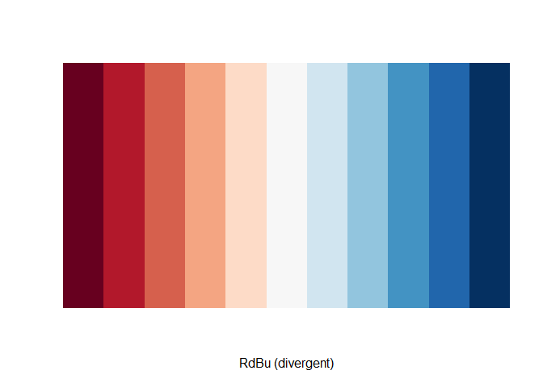<!-- -->

``` r
colnames(mm4)
```

    ##  [1] "exposureCBF" "exposureCBS" "exposureCTR" "exposurePLF" "exposurePLS"
    ##  [6] "exposurePWF" "exposurePWS" "batchNF2"    "batchNF3"    "batchNM1"   
    ## [11] "batchNM2"    "batchNM3"    "batchSF1"    "batchSF2"    "batchSF3"   
    ## [16] "batchSM1"    "batchSM2"    "batchSM3"

``` r
fit4 <- lmFit(y4, mm4) # Fitting linear models in limma

head(coef(fit4))
```

    ##                 exposureCBF exposureCBS exposureCTR exposurePLF exposurePLS
    ## ENSG00000225630    3.697620    3.446782    3.628111    3.664299    3.612861
    ## ENSG00000237973    3.901321    3.684251    3.998707    4.008981    3.905990
    ## ENSG00000248527    7.306140    7.069484    7.388686    7.444703    7.354440
    ## ENSG00000228794    3.050411    3.033723    3.125936    3.066996    3.027666
    ## ENSG00000188976    6.360620    6.293310    6.330709    6.338577    6.279730
    ## ENSG00000187961    2.845102    2.811081    2.773978    2.781415    2.884708
    ##                 exposurePWF exposurePWS    batchNF2    batchNF3    batchNM1
    ## ENSG00000225630    3.604670    3.680598 -0.03865659  0.72876535  0.67167071
    ## ENSG00000237973    3.875996    3.951327  0.48934509  0.32637702  0.35401991
    ## ENSG00000248527    7.301502    7.303130  0.61286730  0.50634463  0.75620339
    ## ENSG00000228794    3.055119    2.968585  0.08120150  0.22993662  0.26083341
    ## ENSG00000188976    6.453554    6.302150 -0.05184930  0.04073716  0.02015945
    ## ENSG00000187961    2.899971    2.836370 -0.05266860 -0.09454157 -0.24889394
    ##                    batchNM2    batchNM3    batchSF1    batchSF2    batchSF3
    ## ENSG00000225630  0.59749883 -0.31028345  0.46645086 -0.52271901 -0.10739134
    ## ENSG00000237973 -0.09210945  0.36523068  0.42619308  0.29012936  0.82430014
    ## ENSG00000248527  0.32899689  0.33009829  0.72160485 -0.13047554  0.46209559
    ## ENSG00000228794  0.01579396  0.16625192 -0.01161010  0.32660041  0.27514590
    ## ENSG00000188976 -0.14408216  0.03283994 -0.08015085  0.08957051 -0.02648292
    ## ENSG00000187961 -0.04491268 -0.15662496 -0.09969143  0.33463467 -0.01079946
    ##                    batchSM1   batchSM2    batchSM3
    ## ENSG00000225630 -0.15512373 0.68493648 -0.23802531
    ## ENSG00000237973 -0.10522468 0.56713121  0.16244740
    ## ENSG00000248527  0.23831248 1.11438948  0.25020613
    ## ENSG00000228794 -0.15244244 0.19871976  0.29251349
    ## ENSG00000188976  0.00432418 0.01866049 -0.08936964
    ## ENSG00000187961  0.31187416 0.27911658 -0.31237282

``` r
x <- colnames(coef(fit4))
length(x)
```

    ## [1] 18

``` r
x # to see the groups
```

    ##  [1] "exposureCBF" "exposureCBS" "exposureCTR" "exposurePLF" "exposurePLS"
    ##  [6] "exposurePWF" "exposurePWS" "batchNF2"    "batchNF3"    "batchNM1"   
    ## [11] "batchNM2"    "batchNM3"    "batchSF1"    "batchSF2"    "batchSF3"   
    ## [16] "batchSM1"    "batchSM2"    "batchSM3"

``` r
x <- x[1:7] # selecting levels representing the exposure groups 
            # to use in the "for" loop

a4 <- list() # list of both coding and non-coding transcripts
b4 <- list() # for storing analyzed data fro significantly altered genes
c4 <- list() # for getting the list of all genes 
d4 <- list() # for storing ENSEMBL transcript names

for(i in 1:length(x)){if(x[i] != "exposureCTR"){
  difference <- paste(x[i],"-","exposureCTR", sep="")
  contr <- makeContrasts(difference, levels = colnames(coef(fit4)))
  tmp <- contrasts.fit(fit4, contr)
  tmp <- eBayes(tmp)
  top.table <- topTable(tmp, sort.by = "P", n = Inf)
  l <- length(which(top.table$adj.P.Val <= 0.1 & abs(top.table$logFC) >= 0.5))
  exposure <- substr(x[i], nchar(x[i])-2, nchar(x[i]))
  print(paste( "Number of transcripts changed in : ", exposure, l))
  silent=TRUE
  top.table <- as.data.frame(top.table)
  try(top.table$symbol <- mapIds(org.Hs.eg.db, keys = row.names(top.table), 
                             keytype = "ENSEMBL", column = "SYMBOL", 
                             multiVals="first")) #adding gene names 
  top.table <- subset(top.table, top.table$symbol != 'NA')
  c4[[i]] <- top.table
  names(c4)[i] <- exposure
  top.table<- top.table %>% 
    mutate(direction = case_when(logFC > 0.5 ~ "up",
                                 logFC < -0.5 ~ "down"))
  top.table <- top.table[(which(top.table$adj.P.Val < 0.1 & 
                                  abs(top.table$logFC) > 0.5)),]
  d4[[i]] = row.names(top.table)
  names(d4)[i] <- exposure
  rownames(top.table) <- NULL
  #rownames(top.table) <- top.table$symbol
  top.table <- top.table [(c(7,1,2,3,4,5,6,8))]
  a4[[i]] = top.table$symbol
  names(a4)[i] <- exposure
  b4[[i]] <- top.table
  names(b4)[i] <- exposure}
  }
```

    ## [1] "Number of transcripts changed in :  CBF 106"

    ## 'select()' returned 1:many mapping between keys and columns

    ## [1] "Number of transcripts changed in :  CBS 39"

    ## 'select()' returned 1:many mapping between keys and columns

    ## [1] "Number of transcripts changed in :  PLF 96"

    ## 'select()' returned 1:many mapping between keys and columns

    ## [1] "Number of transcripts changed in :  PLS 16"

    ## 'select()' returned 1:many mapping between keys and columns

    ## [1] "Number of transcripts changed in :  PWF 338"

    ## 'select()' returned 1:many mapping between keys and columns

    ## [1] "Number of transcripts changed in :  PWS 7"

    ## 'select()' returned 1:many mapping between keys and columns

``` r
# removing the empty control group from the lists
a4[3] <- NULL 
b4[3] <- NULL 
c4[3] <- NULL
d4[3] <- NULL
```

FIGURE 1

``` r
#printing volcano plot
res.df <- as.data.frame(c4[1]) # Cardboard Flaming
colnames(res.df) <- substr(colnames(res.df), 5, (nchar(colnames(res.df))))

EnhancedVolcano(res.df,
                lab = res.df$symbol,
                x = 'logFC',
                y = 'adj.P.Val',
                title = 'Cardboard Flaming',
                xlim = c(-2.0, 4.0),
                ylim = c(0, -log10(10e-12)),
                pCutoff = 10e-2,
                pCutoffCol = 'adj.P.Val',
                FCcutoff = 0.5,
                boxedLabels = TRUE,
                parseLabels = TRUE,
                selectLab = c('CILP', 'EDN2', 'CXCL5', 'VNN2', 'MAB21L3',
                              'CYP1A1', 'MT1A', 'MT1G', 'CYP1B1', 'MT1M'),
                col = c('black', 'black', 'black', 'red3'),
                pointSize = 3.0,
                labSize = 5.0,
                colAlpha = 1,
                legendPosition = 'none',
                legendLabSize = 12,
                legendIconSize = 5.0,
                drawConnectors = TRUE,
                widthConnectors = 1.0,
                colConnectors = 'black')
```

<!-- -->

``` r
#printing volcano plot
res.df <- as.data.frame(c4[2]) # Cardboard Smoldering
colnames(res.df) <- substr(colnames(res.df), 5, (nchar(colnames(res.df))))

EnhancedVolcano(res.df,
                lab = res.df$symbol,
                x = 'logFC',
                y = 'adj.P.Val',
                title = 'Cardboard Smoldering',
                xlim = c(-2.0, 4.0),
                ylim = c(0, -log10(10e-12)),
                pCutoff = 10e-2,
                pCutoffCol = 'adj.P.Val',
                FCcutoff = 0.5,
                boxedLabels = TRUE,
                parseLabels = TRUE,
                selectLab = c('CILP', 'TYMS', 'UBD', 'CYP2A13', 'FN1',
                              'OLFM4', 'SFTPB', 'UCHL1', 'CRCT1', 'AKR1B10'),
                col = c('black', 'black', 'black', 'red3'),
                pointSize = 3.0,
                labSize = 5.0,
                colAlpha = 1,
                legendPosition = 'none',
                legendLabSize = 12,
                legendIconSize = 5.0,
                drawConnectors = TRUE,
                widthConnectors = 1.0,
                colConnectors = 'black')
```

<!-- -->

``` r
#printing volcano plot
res.df <- as.data.frame(c4[5]) # Plywood Flaming
colnames(res.df) <- substr(colnames(res.df), 5, (nchar(colnames(res.df))))

EnhancedVolcano(res.df,
                lab = res.df$symbol,
                x = 'logFC',
                y = 'adj.P.Val',
                title = 'Plywood Flaming',
                xlim = c(-2.0, 4.0),
                ylim = c(0, -log10(10e-20)),
                pCutoff = 10e-2,
                pCutoffCol = 'adj.P.Val',
                FCcutoff = 0.5,
                boxedLabels = TRUE,
                parseLabels = TRUE,
                selectLab = c('PTPRT', 'CILP', 'EDN2',  'ANPEP', 'SEC14L3', 
                              'CYP1A1', 'UCHL1', 'CYP1B1',  'AKR1B10', 'CYP1B1-AS1'),
                col = c('black', 'black', 'black', 'red3'),
                pointSize = 3.0,
                labSize = 5.0,
                colAlpha = 1,
                legendPosition = 'none',
                legendLabSize = 12,
                legendIconSize = 5.0,
                drawConnectors = TRUE,
                widthConnectors = 1.0,
                colConnectors = 'black')
```

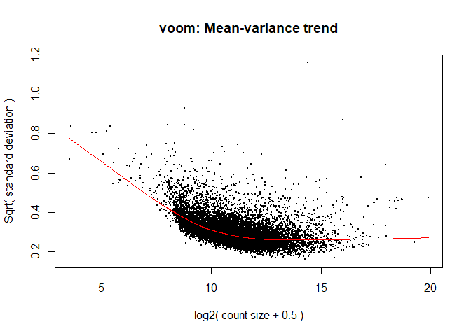<!-- -->

``` r
#printing volcano plot
res.df <- as.data.frame(c4[6]) # Plywood Smoldering
colnames(res.df) <- substr(colnames(res.df), 5, (nchar(colnames(res.df))))

EnhancedVolcano(res.df,
                lab = res.df$symbol,
                x = 'logFC',
                y = 'adj.P.Val',
                title = 'Plywood Smoldering',
                xlim = c(-2.0, 4.0),
                ylim = c(0, -log10(10e-20)),
                pCutoff = 10e-2,
                pCutoffCol = 'adj.P.Val',
                FCcutoff = 0.5,
                boxedLabels = TRUE,
                parseLabels = TRUE,
                selectLab = c('STC2', 'CHAC1', 'CILP', 'DUSP2', 'UCHL1', 
                              'MUC5AC', 'HSPA6'),
                col = c('black', 'black', 'black', 'red3'),
                pointSize = 3.0,
                labSize = 5.0,
                colAlpha = 1,
                legendPosition = 'none',
                legendLabSize = 12,
                legendIconSize = 5.0,
                drawConnectors = TRUE,
                widthConnectors = 1.0,
                colConnectors = 'black')
```

<!-- -->

``` r
#printing volcano plot
res.df <- as.data.frame(c4[3]) # Plastic Flaming
colnames(res.df) <- substr(colnames(res.df), 5, (nchar(colnames(res.df))))

EnhancedVolcano(res.df,
                lab = res.df$symbol,
                x = 'logFC',
                y = 'adj.P.Val',
                title = 'Plastic Flaming',
                xlim = c(-2.0, 4.0),
                ylim = c(0, -log10(10e-12)),
                pCutoff = 10e-2,
                pCutoffCol = 'adj.P.Val',
                FCcutoff = 0.5,
                boxedLabels = TRUE,
                parseLabels = TRUE,
                selectLab = c('CILP', 'EDN2', 'MAB21L3', 'ANPEP', 'PPP1R3C', 
                              'CYP1A1', 'CYP1B1', 'IL6', 'CSF3', 'IL19'),
                col = c('black', 'black', 'black', 'red3'),
                pointSize = 3.0,
                labSize = 5.0,
                colAlpha = 1,
                legendPosition = 'none',
                legendLabSize = 12,
                legendIconSize = 5.0,
                drawConnectors = TRUE,
                widthConnectors = 1.0,
                colConnectors = 'black')
```

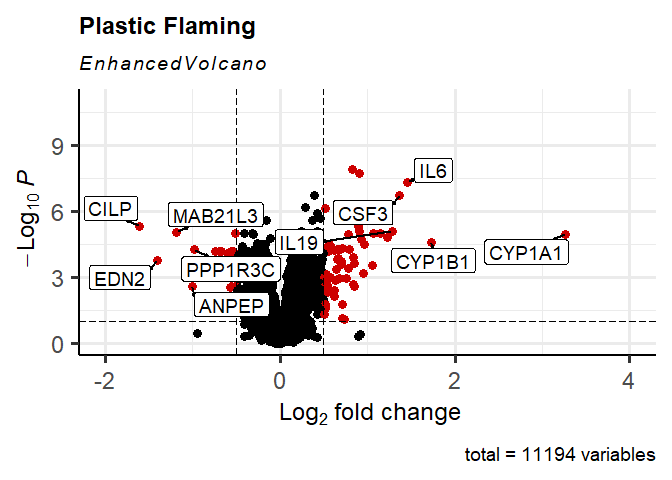<!-- -->

``` r
#printing volcano plot
res.df <- as.data.frame(c4[4]) # Plastic Smoldering
colnames(res.df) <- substr(colnames(res.df), 5, (nchar(colnames(res.df))))

EnhancedVolcano(res.df,
                lab = res.df$symbol,
                x = 'logFC',
                y = 'adj.P.Val',
                title = 'Plastic Smoldering',
                xlim = c(-2.0, 4.0),
                ylim = c(0, -log10(10e-12)),
                pCutoff = 10e-2,
                pCutoffCol = 'adj.P.Val',
                FCcutoff = 0.5,
                boxedLabels = TRUE,
                parseLabels = TRUE,
                selectLab = c( 'H19', 'F2RL3', 'CLDN10', 'CXCL14', 'C5AR2',  
                              'KILH', 'KLK6', 'IL6', 'UCHL1', 'OLFM4'),
                col = c('black', 'black', 'black', 'red3'),
                pointSize = 3.0,
                labSize = 5.0,
                colAlpha = 1,
                legendPosition = 'none',
                legendLabSize = 12,
                legendIconSize = 5.0,
                drawConnectors = TRUE,
                widthConnectors = 1.0,
                colConnectors = 'black')
```

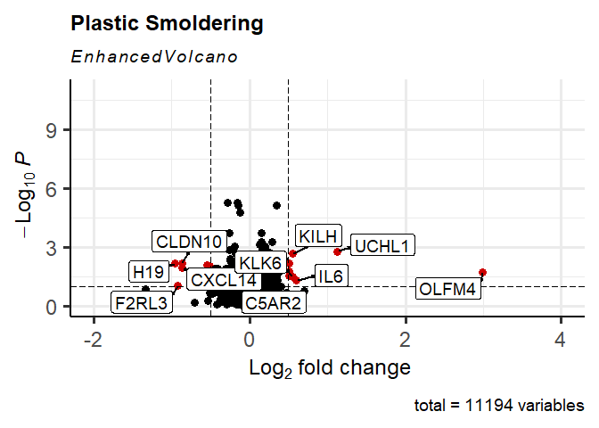<!-- -->

``` r
names(a4) <- str_replace_all(names(a4), c(CBF= "Cardboard\nFlaming",
                                          CBS= "Cardboard\nSmoldering",
                                          PLF= "Plastic\nFlaming",
                                          PLS= "Plastic\nSmoldering",
                                          PWF= "Plywood\nFlaming",
                                          PWS= "Plywood\nSmoldering"))

a4CB <- a4 %>% 
  keep(str_detect(names(a4), "Cardboard"))
names(a4CB) <- sub('Cardboard\n','', names(a4CB))

EP_All_CB <- euler(a4CB, shape = "ellipse") # Euler plot 

plot(EP_All_CB,
     quantities = TRUE, cex = 5,
     main = "Cardboard",
     lty = 1:3,
     labels = list(font = 3, cex = 1.5),
     fills = c("cyan", "white"))
```

<!-- -->

``` r
a4PW <- a4 %>% 
  keep(str_detect(names(a4), "Plywood"))
names(a4PW) <- sub('Plywood\n','', names(a4PW))

EP_All_PW <- euler(a4PW, shape = "ellipse") # Euler plot 

plot(EP_All_PW,
  quantities = TRUE, cex = 5,
  main = "Plywood",
  lty = 1:3,
  labels = list(font = 3, cex = 1.5),
  fills = c("cyan", "white"))
```

<!-- -->

``` r
a4PL <- a4 %>% 
  keep(str_detect(names(a4), "Plastic"))
names(a4PL) <- sub('Plastic\n','', names(a4PL))

EP_All_PL <- euler(a4PL, shape = "ellipse") # Euler plot 

plot(EP_All_PL,
     quantities = TRUE, cex = 5,
     main = "Plastic",
     lty = 1:3,
     labels = list(font = 3, cex = 1.5),
     fills = c("cyan", "white"))
```

<!-- -->

FIGURE 2

``` r
a4F <- a4 %>% 
  keep(str_detect(names(a4), "Flaming"))
names(a4F) <- sub('\nFlaming','', names(a4F))

EP_All_F <- euler(a4F, shape = "ellipse") # Euler plot -flaming
plot(EP_All_F, quantities = TRUE, cex = 5, labels = list(font = 3, cex = 1.5))
```

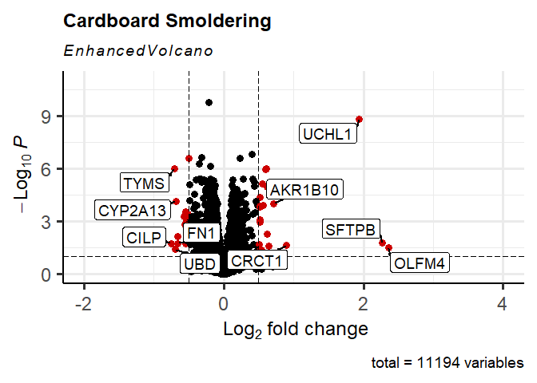<!-- -->

``` r
names(d4) <- str_replace_all(names(d4), c(CBF= "Cardboard Flaming",
                                          CBS= "Cardboard Smoldering",
                                          PLF= "Plastic Flaming",
                                          PLS= "Plastic Smoldering",
                                          PWF= "Plywood Flaming",
                                          PWS= "Plywood Smoldering"))

d4F <- d4 %>% 
  keep(str_detect(names(d4), "Flaming"))
names(d4F) <- sub('\nFlaming','', names(d4F))

z <- process_region_data(Venn(d4F))
z <- as.data.frame(z)

counts_Fg <- counts %>% select(ends_with("CTRL") | 
                               ends_with("CBFh") | 
                               ends_with("PLFh") | 
                               ends_with("PwFh")) # selecting flaming samples

#-----------------------------------------------------------------------#
# Control and flaming

counts_Fg_c <- subset(counts_Fg, rownames(counts_Fg) %in% c(unlist(z[7,3])))

counts_Fg_c <- counts_Fg_c %>% rownames_to_column(var = "transcripts")

counts_Fg_c <- counts_Fg_c %>% pivot_longer(cols = -1, names_to = "SampleID", values_to = "count") 
counts_Fg_c$SampleID <- substr(counts_Fg_c$SampleID, 4, nchar(counts_Fg_c$SampleID))

counts_Fg_c$SampleID <- str_replace_all(counts_Fg_c$SampleID, c(CBFh = "Cardboard",
                                                                PLFh = "Plastic",
                                                                PWFh = "Plywood",
                                                                CTRL = "Control"))

colnames(counts_Fg_c)
```

    ## [1] "transcripts" "SampleID"    "count"

``` r
counts_ALL <- counts_Fg_c %>%
  group_by(transcripts, SampleID) %>%
  summarise(across(everything(), sum))
```

    ## `summarise()` has grouped output by 'transcripts'. You can override using the
    ## `.groups` argument.

``` r
counts_ALL <- counts_ALL %>% pivot_wider(names_from = "SampleID", values_from = "count") %>%
  column_to_rownames(var = "transcripts")

counts_ALL <- counts_ALL %>% relocate("Control", "Cardboard", "Plywood", "Plastic" )
counts_ALL$gene <- mapIds(org.Hs.eg.db, keys = row.names(counts_ALL), 
                         keytype = "ENSEMBL", column = "SYMBOL", 
                         multiVals="first") #adding gene names 
```

    ## 'select()' returned 1:1 mapping between keys and columns

``` r
counts_ALL <- subset(counts_ALL, counts_ALL$gene != 'NA')
rownames(counts_ALL) <- NULL
rownames(counts_ALL) <- counts_ALL$gene
counts_ALL <- counts_ALL[,1:(ncol(counts_ALL)-1)]

temp3 <- as.matrix(counts_ALL)
pheatmap(temp3, 
         color = colorRampPalette(rev(brewer.pal(n = 7, name ="RdYlBu")))(100), 
         # sets color scheme
         display_numbers = FALSE,
         number_color = "black",
         fontsize_number = 5,
         main = "Flaming",
         angle_col = c("45"), # makes column labels horizontal
         cellwidth = 10, # sets dimensions of cells 
         cellheight = 7, # sets dimensions of cells 
         border_color = "black", # adds black border around cells
         treeheight_col = 5, # sets dims of trees 
         fontsize_row = 7, # sets dims of trees 
         scale = 'row', # scales data by row
         fontsize_col = 8, # sets font size for column labels
         cutree_rows = 2, # indicates how many clusters to show 
         cluster_cols = FALSE, 
         cluster_rows = TRUE)
```

<!-- -->

``` r
##########################################################################
# GSEA and GO analyses
##########################################################################

OverL <- process_region_data(Venn(d4F)) #collecting intersect values

OverL$item[7] # viewing 47 transcripts commonly affected by all flaming condensates
```

    ## [[1]]
    ##  [1] "ENSG00000139626" "ENSG00000164199" "ENSG00000100170" "ENSG00000159167"
    ##  [5] "ENSG00000004809" "ENSG00000138615" "ENSG00000232973" "ENSG00000108602"
    ##  [9] "ENSG00000140465" "ENSG00000142224" "ENSG00000138061" "ENSG00000128683"
    ## [13] "ENSG00000071282" "ENSG00000163220" "ENSG00000188089" "ENSG00000026025"
    ## [17] "ENSG00000114812" "ENSG00000177494" "ENSG00000173212" "ENSG00000143546"
    ## [21] "ENSG00000117407" "ENSG00000154175" "ENSG00000197838" "ENSG00000115461"
    ## [25] "ENSG00000170961" "ENSG00000108551" "ENSG00000169509" "ENSG00000196090"
    ## [29] "ENSG00000136244" "ENSG00000104044" "ENSG00000166250" "ENSG00000184254"
    ## [33] "ENSG00000079215" "ENSG00000173110" "ENSG00000197191" "ENSG00000109511"
    ## [37] "ENSG00000119938" "ENSG00000127129" "ENSG00000215853" "ENSG00000121895"
    ## [41] "ENSG00000204544" "ENSG00000166825" "ENSG00000182585" "ENSG00000134830"
    ## [45] "ENSG00000166828" "ENSG00000196581" "ENSG00000196611"

``` r
#---------------------------------------------#

#GO over-representation analysis
geneOL <- unlist(OverL$item[7])
enGOOL <- enrichGO(gene         = geneOL,
                   OrgDb         = org.Hs.eg.db,
                   keyType       = 'ENSEMBL',
                   ont           = "ALL",
                   pAdjustMethod = "BH",
                   pvalueCutoff  = 0.05,
                   qvalueCutoff  = 0.1)
head(enGOOL)
```

    ##            ONTOLOGY         ID                 Description GeneRatio   BgRatio
    ## GO:0009404       BP GO:0009404     toxin metabolic process      3/41  14/21261
    ## GO:0070486       BP GO:0070486       leukocyte aggregation      3/41  14/21261
    ## GO:0019373       BP GO:0019373    epoxygenase P450 pathway      3/41  18/21261
    ## GO:0014002       BP GO:0014002       astrocyte development      4/41  60/21261
    ## GO:0019748       BP GO:0019748 secondary metabolic process      4/41  66/21261
    ## GO:0050900       BP GO:0050900         leukocyte migration      7/41 463/21261
    ##                  pvalue    p.adjust      qvalue
    ## GO:0009404 2.387331e-06 0.001426431 0.001060478
    ## GO:0070486 2.387331e-06 0.001426431 0.001060478
    ## GO:0019373 5.323196e-06 0.001603287 0.001191961
    ## GO:0014002 5.366651e-06 0.001603287 0.001191961
    ## GO:0019748 7.865896e-06 0.001879949 0.001397646
    ## GO:0050900 2.629613e-05 0.005237313 0.003893673
    ##                                                                                                                     geneID
    ## GO:0009404                                                                 ENSG00000140465/ENSG00000138061/ENSG00000197838
    ## GO:0070486                                                                 ENSG00000163220/ENSG00000143546/ENSG00000170961
    ## GO:0019373                                                                 ENSG00000140465/ENSG00000138061/ENSG00000197838
    ## GO:0014002                                                 ENSG00000163220/ENSG00000026025/ENSG00000143546/ENSG00000136244
    ## GO:0019748                                                 ENSG00000140465/ENSG00000138061/ENSG00000197838/ENSG00000104044
    ## GO:0050900 ENSG00000139626/ENSG00000163220/ENSG00000143546/ENSG00000117407/ENSG00000136244/ENSG00000127129/ENSG00000134830
    ##            Count
    ## GO:0009404     3
    ## GO:0070486     3
    ## GO:0019373     3
    ## GO:0014002     4
    ## GO:0019748     4
    ## GO:0050900     7

``` r
#barplot
barplot(enGOOL, showCategory=10, font = 18, title = "47 -common genes")+ 
  scale_x_continuous(breaks = seq(0, 10, by = 2), limits=c(0,10))+
  theme(axis.text.y = element_text(lineheight = 0.7, size = 15),
        title = element_text(size = 15, face="bold"))
```

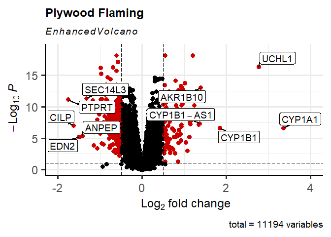<!-- -->

FIGURE 3

``` r
##########################################################################
# Reading in counts data

Gdata <- c4 

##########################################################################
#---------------------------------------------#
# Cardboard exposure group -Flaming

Gdata$CBF <- Gdata$CBF %>% mutate(ProbeID = rownames(Gdata$CBF))   

GdataCBf <- Gdata$CBF #Cardboard
GdataCBf <- select(GdataCBf, ProbeID, logFC)
rownames(GdataCBf) <- NULL

#making ranked gene list
genelist_GdataCBf = GdataCBf[,2] #numeric vector
names(genelist_GdataCBf) = as.character(GdataCBf[,1]) #named vector
genelist_GdataCBf = sort(genelist_GdataCBf, decreasing = TRUE) #must sort in descending order

#Performing GSEA analysis
#Gene Ontology (GO) 
gseGO_CBf_ALL <- gseGO(geneList=genelist_GdataCBf, 
                      ont ="ALL", 
                      keyType = "ENSEMBL", 
                      minGSSize = 10, #min size of gene sets for analysis
                      maxGSSize = 500, #max size of gene sets for analysis
                      pvalueCutoff = 0.05, 
                      eps = 0,
                      verbose = TRUE, 
                      OrgDb = organism, 
                      pAdjustMethod = "BH") #Bbenjamini Hochberg adjustment
```

    ## preparing geneSet collections...

    ## GSEA analysis...

    ## leading edge analysis...

    ## done...

``` r
#dotplot
enrichplot::dotplot(gseGO_CBf_ALL, split=".sign", title = "Cardboard -Flaming",
                    showCategory = 5, font.size = 15, 
                    label_format = 25) + facet_grid(.~.sign)+ 
  scale_x_continuous(breaks = seq(0, 1, by = 1), limits=c(0,1))+
  theme(axis.text.y = element_text(lineheight = 0.7, size = 15),
        title = element_text(size = 15, face="bold"))
```

<!-- -->

``` r
#--------------------------------------------------------------------#

#GO over-representation analysis
geneCBf <- names(genelist_GdataCBf[genelist_GdataCBf[] > 0.5]) # logFC > 0.5
enGOCBf <- enrichGO(gene         = geneCBf,
                   OrgDb         = org.Hs.eg.db,
                   keyType       = 'ENSEMBL',
                   ont           = "ALL",
                   pAdjustMethod = "BH",
                   pvalueCutoff  = 0.05,
                   qvalueCutoff  = 0.1)
head(enGOCBf)
```

    ##            ONTOLOGY         ID                          Description GeneRatio
    ## GO:0009636       BP GO:0009636          response to toxic substance     14/59
    ## GO:0098754       BP GO:0098754                       detoxification     11/59
    ## GO:1990748       BP GO:1990748              cellular detoxification      8/59
    ## GO:0097237       BP GO:0097237 cellular response to toxic substance      8/59
    ## GO:0098869       BP GO:0098869      cellular oxidant detoxification      7/59
    ## GO:0019748       BP GO:0019748          secondary metabolic process      6/59
    ##              BgRatio       pvalue     p.adjust       qvalue
    ## GO:0009636 294/21261 5.224242e-14 7.115418e-11 5.581690e-11
    ## GO:0098754 173/21261 1.499863e-12 1.021406e-09 8.012424e-10
    ## GO:1990748 132/21261 3.029243e-09 1.375276e-06 1.078836e-06
    ## GO:0097237 149/21261 7.894756e-09 2.688164e-06 2.108731e-06
    ## GO:0098869 112/21261 2.535123e-08 6.376023e-06 5.001672e-06
    ## GO:0019748  66/21261 2.808821e-08 6.376023e-06 5.001672e-06
    ##                                                                                                                                                                                                                                     geneID
    ## GO:0009636 ENSG00000140465/ENSG00000205362/ENSG00000125144/ENSG00000138061/ENSG00000205364/ENSG00000198074/ENSG00000181019/ENSG00000176153/ENSG00000163220/ENSG00000130600/ENSG00000151012/ENSG00000271303/ENSG00000095303/ENSG00000198431
    ## GO:0098754                                                 ENSG00000205362/ENSG00000125144/ENSG00000205364/ENSG00000198074/ENSG00000181019/ENSG00000176153/ENSG00000163220/ENSG00000130600/ENSG00000271303/ENSG00000095303/ENSG00000198431
    ## GO:1990748                                                                                                 ENSG00000198074/ENSG00000181019/ENSG00000176153/ENSG00000163220/ENSG00000130600/ENSG00000271303/ENSG00000095303/ENSG00000198431
    ## GO:0097237                                                                                                 ENSG00000198074/ENSG00000181019/ENSG00000176153/ENSG00000163220/ENSG00000130600/ENSG00000271303/ENSG00000095303/ENSG00000198431
    ## GO:0098869                                                                                                                 ENSG00000181019/ENSG00000176153/ENSG00000163220/ENSG00000130600/ENSG00000271303/ENSG00000095303/ENSG00000198431
    ## GO:0019748                                                                                                                                 ENSG00000140465/ENSG00000138061/ENSG00000198074/ENSG00000151012/ENSG00000104044/ENSG00000151632
    ##            Count
    ## GO:0009636    14
    ## GO:0098754    11
    ## GO:1990748     8
    ## GO:0097237     8
    ## GO:0098869     7
    ## GO:0019748     6

``` r
#barplot
barplot(enGOCBf, showCategory=10, font = 15, title = "Cardboard -flaming")+ 
  scale_x_continuous(breaks = seq(0, 20, by = 5), limits=c(0,20))+
  theme(axis.text.y = element_text(lineheight = 0.7, size = 15),
        title = element_text(size = 15, face="bold"))
```

<!-- -->

``` r
##########################################################################
#---------------------------------------------#
# Plywood exposure group -Flaming

Gdata$PWF <- Gdata$PWF %>% mutate(ProbeID = rownames(Gdata$PWF))   

GdataPWf <- Gdata$PWF #Plywood

GdataPWf <- select(GdataPWf, ProbeID, logFC)
rownames(GdataPWf) <- NULL

#making ranked gene list
genelist_GdataPWf = GdataPWf[,2] #numeric vector
names(genelist_GdataPWf) = as.character(GdataPWf[,1]) #named vector
genelist_GdataPWf = sort(genelist_GdataPWf, decreasing = TRUE) #must sort in descending order

#Performing GSEA analysis
#Gene Ontology (GO) 
gseGO_PWf_ALL <- gseGO(geneList=genelist_GdataPWf, 
                      ont ="ALL", 
                      keyType = "ENSEMBL", 
                      minGSSize = 10, #min size of gene sets for analysis
                      maxGSSize = 500, #max size of gene sets for analysis
                      pvalueCutoff = 0.05,
                      eps=0,
                      verbose = TRUE, 
                      OrgDb = organism, 
                      pAdjustMethod = "BH") #Benjamini Hochberg adjustment
```

    ## preparing geneSet collections...

    ## GSEA analysis...

    ## leading edge analysis...

    ## done...

``` r
#dotplot
enrichplot::dotplot(gseGO_PWf_ALL, split=".sign", title = "Plywood -Flaming",
                    showCategory = 5, font.size = 15, 
                    label_format = 25) + facet_grid(.~.sign)+ 
  scale_x_continuous(breaks = seq(0, 1, by = 1), limits=c(0,1))+
  theme(axis.text.y = element_text(lineheight = 0.7, size = 15),
        title = element_text(size = 15, face="bold"))
```

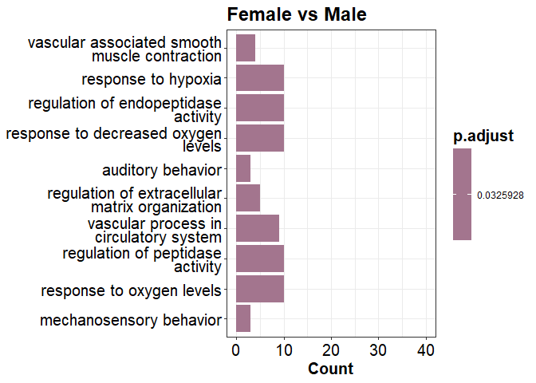<!-- -->

``` r
#--------------------------------------------------------------------#

#GO over-representation analysis
genePWf <- names(genelist_GdataPWf[genelist_GdataPWf[] > 0.5]) # logFC > 0.5
enGOPWf <- enrichGO(gene         = genePWf,
                   OrgDb         = org.Hs.eg.db,
                   keyType       = 'ENSEMBL',
                   ont           = "ALL",
                   pAdjustMethod = "BH",
                   pvalueCutoff  = 0.05,
                   qvalueCutoff  = 0.1)
head(enGOPWf)
```

    ##            ONTOLOGY         ID                              Description
    ## GO:0009636       BP GO:0009636              response to toxic substance
    ## GO:1990748       BP GO:1990748                  cellular detoxification
    ## GO:0098754       BP GO:0098754                           detoxification
    ## GO:0097237       BP GO:0097237     cellular response to toxic substance
    ## GO:0033559       BP GO:0033559 unsaturated fatty acid metabolic process
    ## GO:1901661       BP GO:1901661                quinone metabolic process
    ##            GeneRatio   BgRatio       pvalue     p.adjust       qvalue
    ## GO:0009636     16/85 294/21261 3.969531e-14 6.903014e-11 5.519737e-11
    ## GO:1990748     12/85 132/21261 1.765488e-13 1.119805e-10 8.954102e-11
    ## GO:0098754     13/85 173/21261 1.931808e-13 1.119805e-10 8.954102e-11
    ## GO:0097237     12/85 149/21261 7.601711e-13 3.304844e-10 2.642595e-10
    ## GO:0033559     11/85 124/21261 2.506343e-12 7.508479e-10 6.003874e-10
    ## GO:1901661      8/85  39/21261 2.590619e-12 7.508479e-10 6.003874e-10
    ##                                                                                                                                                                                                                                                                     geneID
    ## GO:0009636 ENSG00000140465/ENSG00000138061/ENSG00000198074/ENSG00000176153/ENSG00000181019/ENSG00000271303/ENSG00000151012/ENSG00000125144/ENSG00000198431/ENSG00000095303/ENSG00000117450/ENSG00000163220/ENSG00000136810/ENSG00000134202/ENSG00000211445/ENSG00000042286
    ## GO:1990748                                                                 ENSG00000198074/ENSG00000176153/ENSG00000181019/ENSG00000271303/ENSG00000198431/ENSG00000095303/ENSG00000117450/ENSG00000163220/ENSG00000136810/ENSG00000134202/ENSG00000211445/ENSG00000042286
    ## GO:0098754                                                 ENSG00000198074/ENSG00000176153/ENSG00000181019/ENSG00000271303/ENSG00000125144/ENSG00000198431/ENSG00000095303/ENSG00000117450/ENSG00000163220/ENSG00000136810/ENSG00000134202/ENSG00000211445/ENSG00000042286
    ## GO:0097237                                                                 ENSG00000198074/ENSG00000176153/ENSG00000181019/ENSG00000271303/ENSG00000198431/ENSG00000095303/ENSG00000117450/ENSG00000163220/ENSG00000136810/ENSG00000134202/ENSG00000211445/ENSG00000042286
    ## GO:0033559                                                                                 ENSG00000140465/ENSG00000138061/ENSG00000187134/ENSG00000151632/ENSG00000186529/ENSG00000171903/ENSG00000085662/ENSG00000125538/ENSG00000095303/ENSG00000196139/ENSG00000106853
    ## GO:1901661                                                                                                                                 ENSG00000198074/ENSG00000187134/ENSG00000181019/ENSG00000151632/ENSG00000171903/ENSG00000085662/ENSG00000196139/ENSG00000042286
    ##            Count
    ## GO:0009636    16
    ## GO:1990748    12
    ## GO:0098754    13
    ## GO:0097237    12
    ## GO:0033559    11
    ## GO:1901661     8

``` r
#barplot
barplot(enGOPWf, showCategory=10, font = 15, title = "Plywood -flaming")+ 
  scale_x_continuous(breaks = seq(0, 20, by = 5), limits=c(0,20))+
  theme(axis.text.y = element_text(lineheight = 0.7, size = 15),
        title = element_text(size = 15, face="bold"))
```

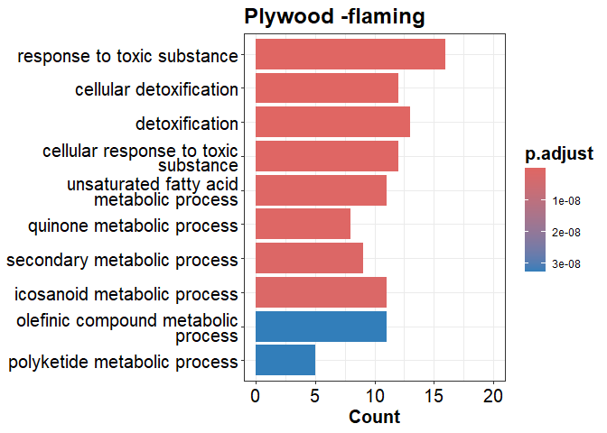<!-- -->

``` r
##########################################################################
#---------------------------------------------#
# Plastic exposure group -Flaming

Gdata$PLF <- Gdata$PLF %>% mutate(ProbeID = rownames(Gdata$PLF))   

GdataPLf <- Gdata$PLF #Plastic

GdataPLf <- select(GdataPLf, ProbeID, logFC)
rownames(GdataPLf) <- NULL

#making ranked gene list
genelist_GdataPLf = GdataPLf[,2] #numeric vector
names(genelist_GdataPLf) = as.character(GdataPLf[,1]) #named vector
genelist_GdataPLf = sort(genelist_GdataPLf, decreasing = TRUE) #must sort in descending order

#Performing GSEA analysis
#Gene Ontology (GO) 
gseGO_PLf_ALL <- gseGO(geneList=genelist_GdataPLf, 
                      ont ="ALL", 
                      keyType = "ENSEMBL", 
                      minGSSize = 10, #min size of gene sets for analysis
                      maxGSSize = 500, #max size of gene sets for analysis
                      pvalueCutoff = 0.05,
                      eps=0,
                      verbose = TRUE, 
                      OrgDb = organism, 
                      pAdjustMethod = "BH") #Benjamini Hochberg adjustment
```

    ## preparing geneSet collections...

    ## GSEA analysis...

    ## leading edge analysis...

    ## done...

``` r
#dotplot
enrichplot::dotplot(gseGO_PLf_ALL, split=".sign", title = "Plastic -Flaming",
                    showCategory = 5, font.size = 15, 
                    label_format = 25) + facet_grid(.~.sign)+ 
  scale_x_continuous(breaks = seq(0, 1, by = 1), limits=c(0,1))+
  theme(axis.text.y = element_text(lineheight = 0.7, size = 15),
        title = element_text(size = 15, face="bold"))
```

<!-- -->

``` r
#--------------------------------------------------------------------#

#GO over-representation analysis
genePLf <- names(genelist_GdataPLf[genelist_GdataPLf[] > 0.5]) # logFC > 0.5
enGOPLf <- enrichGO(gene         = genePLf,
                   OrgDb         = org.Hs.eg.db,
                   keyType       = 'ENSEMBL',
                   ont           = "ALL",
                   pAdjustMethod = "BH",
                   pvalueCutoff  = 0.05,
                   qvalueCutoff  = 0.1)
head(enGOPLf)
```

    ##            ONTOLOGY         ID
    ## GO:0032496       BP GO:0032496
    ## GO:0002237       BP GO:0002237
    ## GO:0010575       BP GO:0010575
    ## GO:0070486       BP GO:0070486
    ## GO:1990266       BP GO:1990266
    ## GO:0050900       BP GO:0050900
    ##                                                                     Description
    ## GO:0032496                                       response to lipopolysaccharide
    ## GO:0002237                             response to molecule of bacterial origin
    ## GO:0010575 positive regulation of vascular endothelial growth factor production
    ## GO:0070486                                                leukocyte aggregation
    ## GO:1990266                                                 neutrophil migration
    ## GO:0050900                                                  leukocyte migration
    ##            GeneRatio   BgRatio       pvalue     p.adjust       qvalue
    ## GO:0032496     12/58 412/21261 9.538469e-10 1.545232e-06 1.037183e-06
    ## GO:0002237     12/58 446/21261 2.334584e-09 1.891013e-06 1.269276e-06
    ## GO:0010575      5/58  31/21261 2.038326e-08 1.100696e-05 7.388038e-06
    ## GO:0070486      4/58  14/21261 4.889250e-08 1.980146e-05 1.329104e-05
    ## GO:1990266      7/58 148/21261 1.534445e-07 4.971603e-05 3.337015e-05
    ## GO:0050900     10/58 463/21261 4.458665e-07 1.152430e-04 7.735281e-05
    ##                                                                                                                                                                                                     geneID
    ## GO:0032496 ENSG00000140465/ENSG00000136244/ENSG00000108342/ENSG00000143546/ENSG00000125538/ENSG00000163220/ENSG00000073756/ENSG00000163734/ENSG00000115008/ENSG00000121742/ENSG00000136688/ENSG00000169429
    ## GO:0002237 ENSG00000140465/ENSG00000136244/ENSG00000108342/ENSG00000143546/ENSG00000125538/ENSG00000163220/ENSG00000073756/ENSG00000163734/ENSG00000115008/ENSG00000121742/ENSG00000136688/ENSG00000169429
    ## GO:0010575                                                                                                                 ENSG00000138061/ENSG00000136244/ENSG00000125538/ENSG00000073756/ENSG00000115008
    ## GO:0070486                                                                                                                                 ENSG00000143546/ENSG00000125538/ENSG00000163220/ENSG00000170961
    ## GO:1990266                                                                                 ENSG00000143546/ENSG00000134830/ENSG00000125538/ENSG00000163220/ENSG00000163734/ENSG00000115008/ENSG00000169429
    ## GO:0050900                                 ENSG00000136244/ENSG00000143546/ENSG00000139626/ENSG00000134830/ENSG00000125538/ENSG00000163220/ENSG00000117407/ENSG00000163734/ENSG00000115008/ENSG00000169429
    ##            Count
    ## GO:0032496    12
    ## GO:0002237    12
    ## GO:0010575     5
    ## GO:0070486     4
    ## GO:1990266     7
    ## GO:0050900    10

``` r
#barplot
barplot(enGOPLf, showCategory=10, size = 15, title = "Plastic -flaming")+ 
  scale_x_continuous(breaks = seq(0, 20, by = 5), limits=c(0,20))+
  theme(axis.text.y = element_text(lineheight = 0.7, size = 15),
        title = element_text(size = 15, face="bold"))
```

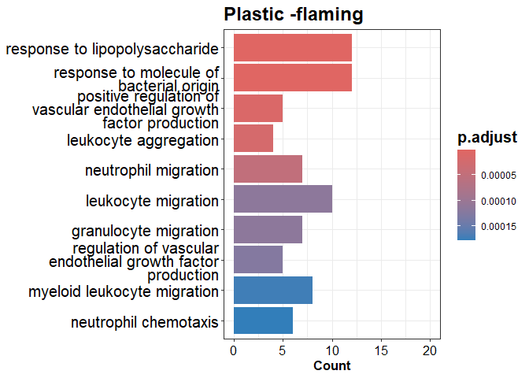<!-- -->

FIGURE E2

``` r
#--------------------------------------------------------------------#
# Enrichment Map:

gse1 <- pairwise_termsim(gseGO_CBf_ALL)
emapplot(gse1, showCategory = 10) + ggtitle("Cardboard -flaming")+
  theme(title = element_text(size = 15, face="bold"))
```

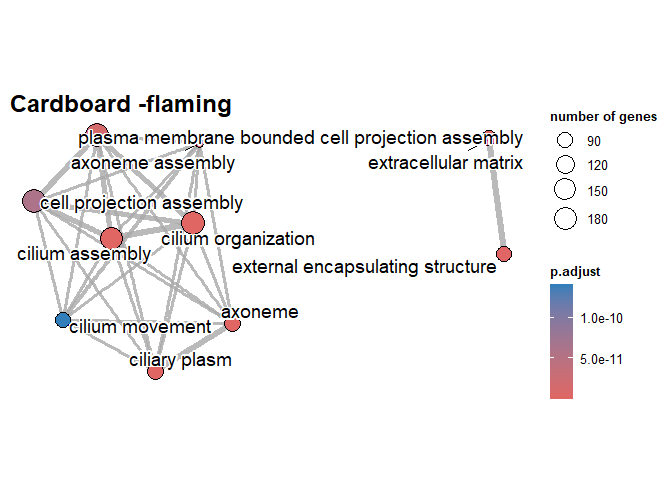<!-- -->

``` r
gse2 <- pairwise_termsim(gseGO_PWf_ALL)
emapplot(gse2, showCategory = 10) + ggtitle("Plywood -flaming")+
  theme(title = element_text(size = 15, face="bold"))
```

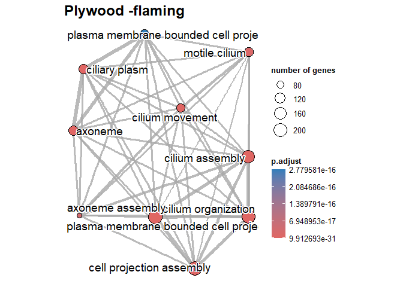<!-- -->

``` r
gse3 <- pairwise_termsim(gseGO_PLf_ALL)
emapplot(gse3, showCategory = 10) + ggtitle("Plastic -flaming")+
  theme(title = element_text(size = 15, face="bold"))
```

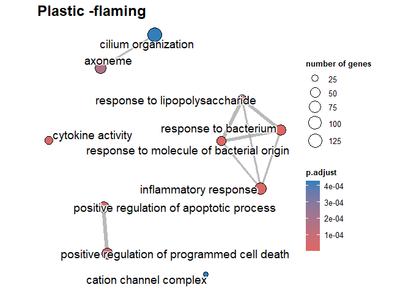<!-- -->

``` r
#--------------------------------------------------------------------#
```

FIGURE E3

``` r
a4S <- a4 %>% 
  keep(str_detect(names(a4), "Smoldering"))
names(a4S) <- sub('\nSmoldering','', names(a4S))

EP_All_S <- euler(a4S, shape = "ellipse") # Euler plot -smoldering
plot(EP_All_S, quantities = TRUE, cex = 5, labels = list(font = 3, cex = 1.5))
```

<!-- -->

FIGURE E4

``` r
#---------------------------------------------#
# Smoldering #
#---------------------------------------------#

# Cardboard exposure group -Smoldering
Gdata$CBS <- Gdata$CBS %>% mutate(ProbeID = rownames(Gdata$CBS))   
GdataCBs <- Gdata$CBS #Cardboard
GdataCBs <- select(GdataCBs, ProbeID, logFC)
rownames(GdataCBs) <- NULL

#making ranked gene list
genelist_GdataCBs = GdataCBs[,2] #numeric vector
names(genelist_GdataCBs) = as.character(GdataCBs[,1]) #named vector
genelist_GdataCBs = sort(genelist_GdataCBs, decreasing = TRUE) #must sort in descending order

#Performing GSEA analysis
#Gene Ontology (GO) 
gseGO_CBs_ALL <- gseGO(geneList=genelist_GdataCBs, 
                      ont ="ALL", 
                      keyType = "ENSEMBL", 
                      minGSSize = 10, #min size of gene sets for analysis
                      maxGSSize = 500, #max size of gene sets for analysis
                      pvalueCutoff = 0.05, 
                      eps = 0,
                      verbose = TRUE, 
                      OrgDb = organism, 
                      pAdjustMethod = "BH") #Benjamini Hochberg adjustment
```

    ## preparing geneSet collections...

    ## GSEA analysis...

    ## leading edge analysis...

    ## done...

``` r
#dotplot
enrichplot::dotplot(gseGO_CBs_ALL, split=".sign", title = "Cardboard -Smoldering",
                    showCategory = 5, font.size = 15,  label_format = 50) + facet_grid(.~.sign)+ 
  scale_x_continuous(breaks = seq(0, 1, by = 1), limits=c(0,1))+
  theme(axis.text.y = element_text(lineheight = 0.80, size = 15),
        title = element_text(size = 15, face="bold"),
        plot.title = element_text(hjust=0.5))+
  coord_fixed(ratio = 1, xlim = NULL, ylim = NULL, expand = TRUE, clip = "on") 
```

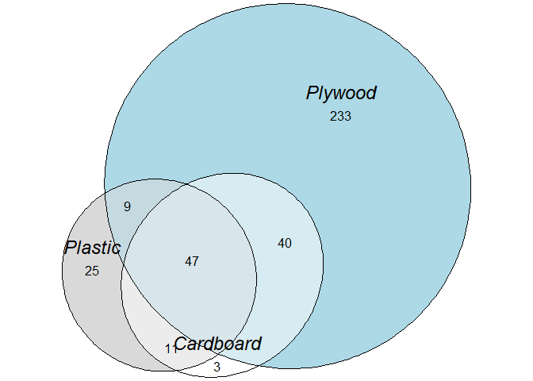<!-- -->

``` r
#GO over-representation analysis
geneCBs <- names(genelist_GdataCBs[genelist_GdataCBs[] > 0.5]) # logFC > 0.5
enGOCBs <- enrichGO(gene         = geneCBs,
                   OrgDb         = org.Hs.eg.db,
                   keyType       = 'ENSEMBL',
                   ont           = "ALL",
                   pAdjustMethod = "BH",
                   pvalueCutoff  = 0.05,
                   qvalueCutoff  = 0.1)
head(enGOCBs)
```

    ##            ONTOLOGY         ID                              Description
    ## GO:0071466       BP GO:0071466 cellular response to xenobiotic stimulus
    ## GO:0097267       BP GO:0097267           omega-hydroxylase P450 pathway
    ## GO:0006805       BP GO:0006805             xenobiotic metabolic process
    ## GO:0019369       BP GO:0019369       arachidonic acid metabolic process
    ## GO:0120254       BP GO:0120254      olefinic compound metabolic process
    ## GO:0009410       BP GO:0009410          response to xenobiotic stimulus
    ##            GeneRatio   BgRatio       pvalue     p.adjust       qvalue
    ## GO:0071466      6/20 208/21261 2.820202e-08 1.785188e-05 1.151830e-05
    ## GO:0097267      3/20  10/21261 8.505967e-08 2.692138e-05 1.737008e-05
    ## GO:0006805      5/20 133/21261 1.277058e-07 2.694593e-05 1.738592e-05
    ## GO:0019369      4/20  64/21261 3.488363e-07 5.520335e-05 3.561802e-05
    ## GO:0120254      5/20 183/21261 6.244366e-07 7.905368e-05 5.100661e-05
    ## GO:0009410      6/20 476/21261 3.622646e-06 3.687790e-04 2.379417e-04
    ##                                                                                                     geneID
    ## GO:0071466 ENSG00000154277/ENSG00000140465/ENSG00000138061/ENSG00000108846/ENSG00000108602/ENSG00000181019
    ## GO:0097267                                                 ENSG00000140465/ENSG00000138061/ENSG00000171903
    ## GO:0006805                 ENSG00000140465/ENSG00000138061/ENSG00000108846/ENSG00000108602/ENSG00000181019
    ## GO:0019369                                 ENSG00000140465/ENSG00000138061/ENSG00000186529/ENSG00000171903
    ## GO:0120254                 ENSG00000198074/ENSG00000140465/ENSG00000138061/ENSG00000186529/ENSG00000171903
    ## GO:0009410 ENSG00000154277/ENSG00000140465/ENSG00000138061/ENSG00000108846/ENSG00000108602/ENSG00000181019
    ##            Count
    ## GO:0071466     6
    ## GO:0097267     3
    ## GO:0006805     5
    ## GO:0019369     4
    ## GO:0120254     5
    ## GO:0009410     6

``` r
#barplot
barplot(enGOCBs, showCategory=10, size = 15, title = "Cardboard -Smoldering")+ 
  scale_x_continuous(breaks = seq(0, 10, by = 5), limits=c(0,10))+
  theme(axis.text.y = element_text(lineheight = 0.7, size = 15),
        title = element_text(size = 15, face="bold"))+ coord_fixed(2)
```

<!-- -->

``` r
#---------------------------------------------------------------------#
# Plywood exposure group -Smoldering

Gdata$PWS <- Gdata$PWS %>% mutate(ProbeID = rownames(Gdata$PWS))   
GdataPWs <- Gdata$PWS #Plywood
GdataPWs <- select(GdataPWs, ProbeID, logFC)
rownames(GdataPWs) <- NULL

#making ranked gene list
genelist_GdataPWs = GdataPWs[,2] #numeric vector
names(genelist_GdataPWs) = as.character(GdataPWs[,1]) #named vector
genelist_GdataPWs = sort(genelist_GdataPWs, decreasing = TRUE) #must sort in descending order

#Performing GSEA analysis
#Gene Ontology (GO) 
gseGO_PWs_ALL <- gseGO(geneList=genelist_GdataPWs, 
                       ont ="ALL", 
                       keyType = "ENSEMBL", 
                       minGSSize = 10, #min size of gene sets for analysis
                       maxGSSize = 500, #max size of gene sets for analysis
                       pvalueCutoff = 0.05, 
                       eps = 0,
                       verbose = TRUE, 
                       OrgDb = organism, 
                       pAdjustMethod = "BH") #Benjamini Hochberg adjustment
```

    ## preparing geneSet collections...

    ## GSEA analysis...

    ## leading edge analysis...

    ## done...

``` r
#dotplot
enrichplot::dotplot(gseGO_PWs_ALL, split=".sign", title = "Plywood -Smoldering",
                    showCategory = 5, font.size = 15,  label_format = 50) + facet_grid(.~.sign)+ 
  scale_x_continuous(breaks = seq(0, 1, by = 1), limits=c(0,1))+
  theme(axis.text.y = element_text(lineheight = 0.80, size = 15),
        title = element_text(size = 15, face="bold"),
        plot.title = element_text(hjust=0.5))+
  coord_fixed(ratio = 1, xlim = NULL, ylim = NULL, expand = TRUE, clip = "on")
```

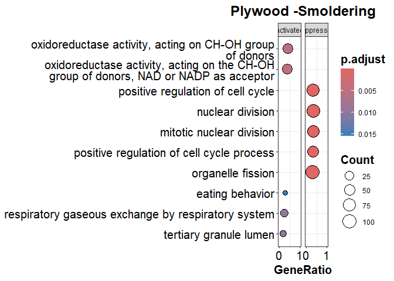<!-- -->

``` r
#GO over-representation analysis
genePWs <- names(genelist_GdataPWs[genelist_GdataPWs[] > 0.5]) # logFC > 0.5
enGOPWs <- enrichGO(gene         = genePWs,
                    OrgDb         = org.Hs.eg.db,
                    keyType       = 'ENSEMBL',
                    ont           = "ALL",
                    pAdjustMethod = "BH",
                    pvalueCutoff  = 0.05,
                    qvalueCutoff  = 0.1)
head(enGOPWs)
```

    ##            ONTOLOGY         ID                                     Description
    ## GO:0034774       CC GO:0034774                         secretory granule lumen
    ## GO:0060205       CC GO:0060205                       cytoplasmic vesicle lumen
    ## GO:0031983       CC GO:0031983                                   vesicle lumen
    ## GO:0042599       CC GO:0042599                                   lamellar body
    ## GO:0008330       MF GO:0008330 protein tyrosine/threonine phosphatase activity
    ## GO:0033550       MF GO:0033550        MAP kinase tyrosine phosphatase activity
    ##            GeneRatio   BgRatio      pvalue   p.adjust      qvalue
    ## GO:0034774       2/6 381/22568 0.004076742 0.03045377 0.011872815
    ## GO:0060205       2/6 384/22568 0.004139803 0.03045377 0.011872815
    ## GO:0031983       2/6 385/22568 0.004160925 0.03045377 0.011872815
    ## GO:0042599       1/6  17/22568 0.004511670 0.03045377 0.011872815
    ## GO:0008330       1/7  14/21059 0.004644982 0.02966200 0.009757238
    ## GO:0033550       1/7  14/21059 0.004644982 0.02966200 0.009757238
    ##                                     geneID Count
    ## GO:0034774 ENSG00000102837/ENSG00000173110     2
    ## GO:0060205 ENSG00000102837/ENSG00000173110     2
    ## GO:0031983 ENSG00000102837/ENSG00000173110     2
    ## GO:0042599                 ENSG00000168878     1
    ## GO:0008330                 ENSG00000158050     1
    ## GO:0033550                 ENSG00000158050     1

``` r
#barplot
barplot(enGOPWs, showCategory=10, size = 15, title = "Plywood -Smoldering")+ 
  scale_x_continuous(breaks = seq(0, 10, by = 5), limits=c(0,10))+
  theme(axis.text.y = element_text(lineheight = 0.7, size = 15),
        title = element_text(size = 15, face="bold"))+ coord_fixed(2)
```

<!-- -->

``` r
#---------------------------------------------------------------------#
# Plastic exposure group -Smoldering

Gdata$PLS <- Gdata$PLS %>% mutate(ProbeID = rownames(Gdata$PLS))   
GdataPLs <- Gdata$PLS #Plywood
GdataPLs <- select(GdataPLs, ProbeID, logFC)
rownames(GdataPLs) <- NULL

#making ranked gene list
genelist_GdataPLs = GdataPLs[,2] #numeric vector
names(genelist_GdataPLs) = as.character(GdataPLs[,1]) #named vector
genelist_GdataPLs = sort(genelist_GdataPLs, decreasing = TRUE) #must sort in descending order

#Performing GSEA analysis
#Gene Ontology (GO) 
gseGO_PLs_ALL <- gseGO(geneList=genelist_GdataPLs, 
                       ont ="ALL", 
                       keyType = "ENSEMBL", 
                       minGSSize = 10, #min size of gene sets for analysis
                       maxGSSize = 500, #max size of gene sets for analysis
                       pvalueCutoff = 0.05, 
                       eps = 0,
                       verbose = TRUE, 
                       OrgDb = organism, 
                       pAdjustMethod = "BH") #Benjamini Hochberg adjustment
```

    ## preparing geneSet collections...

    ## GSEA analysis...

    ## leading edge analysis...

    ## done...

``` r
#dotplot
enrichplot::dotplot(gseGO_PLs_ALL, split=".sign", title = "Plastic -Smoldering",
                    showCategory = 5, font.size = 15, label_format = 50) + facet_grid(.~.sign)+ 
  scale_x_continuous(breaks = seq(0, 1, by = 1), limits=c(0,1))+
  theme(axis.text.y = element_text(lineheight = 0.80, size = 15),
        title = element_text(size = 15, face="bold"),
        plot.title = element_text(hjust=0.5))+
  coord_fixed(ratio = 1, xlim = NULL, ylim = NULL, expand = TRUE, clip = "on") 
```

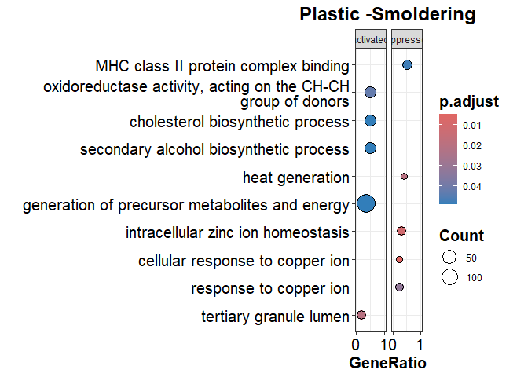<!-- -->

``` r
#GO over-representation analysis
genePLs <- names(genelist_GdataPLs[genelist_GdataPLs[] > 0.5]) # logFC > 0.5
enGOPLs <- enrichGO(gene         = genePLs,
                    OrgDb         = org.Hs.eg.db,
                    keyType       = 'ENSEMBL',
                    ont           = "ALL",
                    pAdjustMethod = "BH",
                    pvalueCutoff  = 0.05,
                    qvalueCutoff  = 0.1)
head(enGOPLs)
```

    ##            ONTOLOGY         ID          Description GeneRatio   BgRatio
    ## GO:0045171       CC GO:0045171 intercellular bridge       2/7 104/22568
    ##                 pvalue   p.adjust      qvalue                          geneID
    ## GO:0045171 0.000435085 0.00783153 0.005037827 ENSG00000102837/ENSG00000167755
    ##            Count
    ## GO:0045171     2

``` r
#barplot
barplot(enGOPLs, showCategory=10, font = 15, title = "Plastic -Smoldering")+
scale_x_continuous(breaks = seq(0, 10, by = 5), limits=c(0,10))+
  theme(axis.text.y = element_text(lineheight = 0.7, size = 15),
        title = element_text(size = 15, face="bold"))+ coord_fixed(2)
```

<!-- -->

Figure 4

``` r
###########################################################
# CORRELATION WITH CHEMICAL COMPOUNDS
##########################################################################

# Reading in PAH values 
# in burn pit smoke condensates

ChCs <- read_excel("chemical_concentrations.xlsx", 
                   sheet=1, 
                   col_names = TRUE)
```

    ## New names:
    ## • `` -> `...1`

``` r
ChCs <- as.data.frame(ChCs)
ChCs <- as.matrix(ChCs)
head(ChCs)
```

    ##      ...1             Cardboard Flaming Cardboard Smoldering Plastic Flaming
    ## [1,] "Naphthalene"    "18400"           " 59"                "139425"       
    ## [2,] "Acenaphthylene" " 7000"           " 59"                " 83125"       
    ## [3,] "Acenaphthene"   "  650"           " 59"                "  4450"       
    ## [4,] "Fluorene"       " 3450"           "100"                " 47775"       
    ## [5,] "Phenanthrene"   "38100"           "225"                "195425"       
    ## [6,] "Anthracene"     " 4150"           " 59"                " 36675"       
    ##      Plastic Smoldering Plywood Flaming Plywood Smoldering
    ## [1,] "1075"             "18150"         " 59"             
    ## [2,] "  59"             " 6225"         " 59"             
    ## [3,] " 200"             "  400"         " 59"             
    ## [4,] " 700"             " 2625"         "125"             
    ## [5,] "1075"             "32425"         "150"             
    ## [6,] "  59"             " 3100"         " 59"

``` r
row.names(ChCs) <- ChCs[,1]

ChCs <- ChCs[,2:ncol(ChCs)]
ChCs <- t(ChCs)

head(ChCs)
```

    ##                      Naphthalene Acenaphthylene Acenaphthene Fluorene
    ## Cardboard Flaming    "18400"     " 7000"        "  650"      " 3450" 
    ## Cardboard Smoldering " 59"       " 59"          " 59"        "100"   
    ## Plastic Flaming      "139425"    " 83125"       "  4450"     " 47775"
    ## Plastic Smoldering   "1075"      "  59"         " 200"       " 700"  
    ## Plywood Flaming      "18150"     " 6225"        "  400"      " 2625" 
    ## Plywood Smoldering   " 59"       " 59"          " 59"        "125"   
    ##                      Phenanthrene Anthracene Fluoranthene Pyrene  
    ## Cardboard Flaming    "38100"      " 4150"    "29850"      "26250" 
    ## Cardboard Smoldering "225"        " 59"      " 59"        " 59"   
    ## Plastic Flaming      "195425"     " 36675"   " 77750"     " 62775"
    ## Plastic Smoldering   "1075"       "  59"     " 150"       "  59"  
    ## Plywood Flaming      "32425"      " 3100"    "32975"      "23050" 
    ## Plywood Smoldering   "150"        " 59"      " 59"        " 59"   
    ##                      Benz(a)anthracene Chrysene Benzo(b)fluoranthene
    ## Cardboard Flaming    " 8450"           " 7175"  "10400"             
    ## Cardboard Smoldering " 59"             " 59"    " 59"               
    ## Plastic Flaming      " 21825"          " 20200" " 33750"            
    ## Plastic Smoldering   "  59"            " 150"   "  75"              
    ## Plywood Flaming      " 7125"           " 7325"  "12150"             
    ## Plywood Smoldering   " 59"             " 59"    " 59"               
    ##                      Benzo(k)fluoranthene Benzo(a)pyrene Indeno[1,2,3-cd]pyrene
    ## Cardboard Flaming    " 3250"              " 4775"        " 3425"               
    ## Cardboard Smoldering " 59"                " 59"          " 59"                 
    ## Plastic Flaming      "  7100"             " 18600"       " 11700"              
    ## Plastic Smoldering   "  59"               "  59"         "  59"                
    ## Plywood Flaming      " 3575"              " 4575"        " 3750"               
    ## Plywood Smoldering   " 59"                " 59"          " 59"                 
    ##                      Dibenzo[ah]anthracene Benzo[ghi]perylene
    ## Cardboard Flaming    "  775"               " 3800"           
    ## Cardboard Smoldering " 59"                 " 59"             
    ## Plastic Flaming      "  3550"              " 14775"          
    ## Plastic Smoldering   "  59"                "  59"            
    ## Plywood Flaming      "  800"               " 3475"           
    ## Plywood Smoldering   " 59"                 " 59"             
    ##                      1,4-Naphthoquinone 1-Naphthalenecarboxaldehyde
    ## Cardboard Flaming    " 1800"            " 7650"                    
    ## Cardboard Smoldering "225"              "100"                      
    ## Plastic Flaming      "  8525"           " 16925"                   
    ## Plastic Smoldering   " 250"             " 200"                     
    ## Plywood Flaming      "  875"            " 6150"                    
    ## Plywood Smoldering   "150"              " 59"                      
    ##                      9-Fluorenone 9,10-Anthraquinone 1,8-Naphthalic anhydride
    ## Cardboard Flaming    " 7825"      " 4825"            " 7375"                 
    ## Cardboard Smoldering "525"        "125"              " 59"                   
    ## Plastic Flaming      " 29325"     "  6525"           " 14325"                
    ## Plastic Smoldering   "3925"       " 175"             "  59"                  
    ## Plywood Flaming      "13175"      " 6975"            "17125"                 
    ## Plywood Smoldering   "250"        " 59"              " 59"                   
    ##                      Benzanthrone 1-Pyrenecarboxaldehyde
    ## Cardboard Flaming    "12950"      "  725"               
    ## Cardboard Smoldering " 59"        " 59"                 
    ## Plastic Flaming      " 32025"     "  1250"              
    ## Plastic Smoldering   " 100"       "  59"                
    ## Plywood Flaming      "19550"      "  975"               
    ## Plywood Smoldering   " 59"        " 59"                 
    ##                      Benz[a]anthracene-7,12-quinone 4-Nitrobiphenyl
    ## Cardboard Flaming    "  500"                        " 1000"        
    ## Cardboard Smoldering " 59"                          " 59"          
    ## Plastic Flaming      "    75"                       "   750"       
    ## Plastic Smoldering   "  59"                         "  59"         
    ## Plywood Flaming      "  950"                        "  175"        
    ## Plywood Smoldering   " 59"                          " 59"

``` r
sapply(ChCs, class) #to make sure that ChC columns are numeric
```

    ##       18400          59      139425        1075       18150          59 
    ## "character" "character" "character" "character" "character" "character" 
    ##        7000          59       83125          59        6225          59 
    ## "character" "character" "character" "character" "character" "character" 
    ##         650          59        4450         200         400          59 
    ## "character" "character" "character" "character" "character" "character" 
    ##        3450         100       47775         700        2625         125 
    ## "character" "character" "character" "character" "character" "character" 
    ##       38100         225      195425        1075       32425         150 
    ## "character" "character" "character" "character" "character" "character" 
    ##        4150          59       36675          59        3100          59 
    ## "character" "character" "character" "character" "character" "character" 
    ##       29850          59       77750         150       32975          59 
    ## "character" "character" "character" "character" "character" "character" 
    ##       26250          59       62775          59       23050          59 
    ## "character" "character" "character" "character" "character" "character" 
    ##        8450          59       21825          59        7125          59 
    ## "character" "character" "character" "character" "character" "character" 
    ##        7175          59       20200         150        7325          59 
    ## "character" "character" "character" "character" "character" "character" 
    ##       10400          59       33750          75       12150          59 
    ## "character" "character" "character" "character" "character" "character" 
    ##        3250          59        7100          59        3575          59 
    ## "character" "character" "character" "character" "character" "character" 
    ##        4775          59       18600          59        4575          59 
    ## "character" "character" "character" "character" "character" "character" 
    ##        3425          59       11700          59        3750          59 
    ## "character" "character" "character" "character" "character" "character" 
    ##         775          59        3550          59         800          59 
    ## "character" "character" "character" "character" "character" "character" 
    ##        3800          59       14775          59        3475          59 
    ## "character" "character" "character" "character" "character" "character" 
    ##        1800         225        8525         250         875         150 
    ## "character" "character" "character" "character" "character" "character" 
    ##        7650         100       16925         200        6150          59 
    ## "character" "character" "character" "character" "character" "character" 
    ##        7825         525       29325        3925       13175         250 
    ## "character" "character" "character" "character" "character" "character" 
    ##        4825         125        6525         175        6975          59 
    ## "character" "character" "character" "character" "character" "character" 
    ##        7375          59       14325          59       17125          59 
    ## "character" "character" "character" "character" "character" "character" 
    ##       12950          59       32025         100       19550          59 
    ## "character" "character" "character" "character" "character" "character" 
    ##         725          59        1250          59         975          59 
    ## "character" "character" "character" "character" "character" "character" 
    ##         500          59          75          59         950          59 
    ## "character" "character" "character" "character" "character" "character" 
    ##        1000          59         750          59         175          59 
    ## "character" "character" "character" "character" "character" "character"

``` r
mode(ChCs) <- "numeric" # Changing matrix to numeric

#-----------------------------------------------------------------------#
# Reading in inorganic element values 
# in burn pit smoke condensates

IEs <- read_excel("chemical_concentrations.xlsx", 
                   sheet=2, 
                   col_names = TRUE)
```

    ## New names:
    ## • `` -> `...1`

``` r
IEs <- as.data.frame(IEs)
IEs <- as.matrix(IEs)
head(IEs)
```

    ##      ...1            Cardboard Flaming Cardboard Smoldering Plastic Flaming
    ## [1,] "Silver(Ag)"    "4.513900e+01"    "4.079801e+00"       "7.464783e+00" 
    ## [2,] "Aluminium(Al)" "1.895869e+05"    "1.055825e+05"       "1.657821e+05" 
    ## [3,] "Barium(Ba)"    "3.647548e+03"    "5.598425e+02"       "3.971390e+02" 
    ## [4,] "Bismuth(Bi)"   "9.224876e+00"    "4.635075e+00"       "4.640270e+00" 
    ## [5,] "Calcium(Ca)"   "5.062324e+05"    "6.842679e+04"       "1.677721e+04" 
    ## [6,] "Cadmium(Cd)"   "1.123106e+03"    "6.247276e+00"       "3.244178e+01" 
    ##      Plastic Smoldering Plywood Flaming Plywood Smoldering
    ## [1,] "    5.456312"     "9.112535e+01"  "6.085101e+00"    
    ## [2,] "30944.772107"     "1.881952e+05"  "1.337137e+05"    
    ## [3,] "  196.861092"     "3.100334e+03"  "3.279433e+02"    
    ## [4,] "    4.673249"     "4.634007e+00"  "4.618102e+00"    
    ## [5,] "33522.658482"     "4.512605e+05"  "4.276848e+04"    
    ## [6,] "    6.298726"     "1.616845e+02"  "6.224398e+00"

``` r
row.names(IEs) <- IEs[,1]

IEs <- IEs[,2:ncol(IEs)]
IEs <- t(IEs)

head(IEs)
```

    ##                      Silver(Ag)     Aluminium(Al)  Barium(Ba)    
    ## Cardboard Flaming    "4.513900e+01" "1.895869e+05" "3.647548e+03"
    ## Cardboard Smoldering "4.079801e+00" "1.055825e+05" "5.598425e+02"
    ## Plastic Flaming      "7.464783e+00" "1.657821e+05" "3.971390e+02"
    ## Plastic Smoldering   "    5.456312" "30944.772107" "  196.861092"
    ## Plywood Flaming      "9.112535e+01" "1.881952e+05" "3.100334e+03"
    ## Plywood Smoldering   "6.085101e+00" "1.337137e+05" "3.279433e+02"
    ##                      Bismuth(Bi)    Calcium(Ca)    Cadmium(Cd)   
    ## Cardboard Flaming    "9.224876e+00" "5.062324e+05" "1.123106e+03"
    ## Cardboard Smoldering "4.635075e+00" "6.842679e+04" "6.247276e+00"
    ## Plastic Flaming      "4.640270e+00" "1.677721e+04" "3.244178e+01"
    ## Plastic Smoldering   "    4.673249" "33522.658482" "    6.298726"
    ## Plywood Flaming      "4.634007e+00" "4.512605e+05" "1.616845e+02"
    ## Plywood Smoldering   "4.618102e+00" "4.276848e+04" "6.224398e+00"
    ##                      Cobalt(Co)     Chromium(Cr)   Copper(Cu)    
    ## Cardboard Flaming    "3.691271e+01" "1.496991e+03" "2.951415e+04"
    ## Cardboard Smoldering "5.437271e+01" "4.960772e+02" "5.863243e+03"
    ## Plastic Flaming      "5.073116e+00" "1.748774e+02" "9.130588e+03"
    ## Plastic Smoldering   "   15.531724" "  111.679455" " 1568.788335"
    ## Plywood Flaming      "5.804661e+01" "1.309426e+03" "3.842478e+04"
    ## Plywood Smoldering   "1.823565e+01" "3.093518e+02" "1.255228e+04"
    ##                      Iron(Fe)       Potassium(K)   Magnesium(Mg) 
    ## Cardboard Flaming    "1.738679e+04" "4.805980e+04" "6.615910e+04"
    ## Cardboard Smoldering "1.245742e+04" "6.683411e+03" "1.588520e+04"
    ## Plastic Flaming      "2.209968e+03" "3.201848e+03" "4.519769e+03"
    ## Plastic Smoldering   " 2693.602834" " 2311.852056" " 6887.049612"
    ## Plywood Flaming      "1.529375e+04" "4.826972e+04" "6.489042e+04"
    ## Plywood Smoldering   "6.064904e+03" "4.376809e+03" "1.321981e+04"
    ##                      Manganese(Mn)  Molybdenum(Mo) Sodium(Na)    
    ## Cardboard Flaming    "5.064113e+02" "3.107438e+01" "8.000476e+05"
    ## Cardboard Smoldering "2.110814e+02" "2.514149e+01" "1.881778e+05"
    ## Plastic Flaming      "6.024994e+01" "3.193461e+01" "2.242862e+05"
    ## Plastic Smoldering   "  119.498101" "   22.350319" "55207.111870"
    ## Plywood Flaming      "1.001207e+03" "3.273762e+01" "1.099099e+06"
    ## Plywood Smoldering   "1.462239e+02" "1.452633e+01" "2.282125e+05"
    ##                      Nickel(Ni)     Phosphorus(P)  Lead(Pb)      
    ## Cardboard Flaming    "9.764304e+02" "6.489554e+03" "3.251293e+02"
    ## Cardboard Smoldering "6.441665e+02" "5.683006e+01" "3.984432e+01"
    ## Plastic Flaming      "1.032966e+02" "5.689375e+01" "4.196020e+01"
    ## Plastic Smoldering   "   90.280263" "   57.298090" "   19.707950"
    ## Plywood Flaming      "1.504843e+03" "6.530460e+03" "2.144221e+02"
    ## Plywood Smoldering   "3.113730e+02" "5.662194e+01" "4.111933e+01"
    ##                      Sulphur(S)     Antimony(Sb)   Silicon(Si)   
    ## Cardboard Flaming    "7.276526e+05" "2.334272e+03" "1.546707e+06"
    ## Cardboard Smoldering "1.026258e+05" "6.191472e+02" "1.991550e+05"
    ## Plastic Flaming      "2.017509e+04" "4.114115e+03" "1.395676e+06"
    ## Plastic Smoldering   "29442.760558" "  221.761464" "39984.992009"
    ## Plywood Flaming      "1.551957e+05" "1.323120e+03" "1.889320e+06"
    ## Plywood Smoldering   "2.007870e+04" "6.244928e+02" "5.035145e+05"
    ##                      Tin(Sn)        Strontium(Sr)  Titanium(Ti)  
    ## Cardboard Flaming    "5.671628e+01" "3.708256e+03" "6.662458e+02"
    ## Cardboard Smoldering "1.007625e+00" "5.072270e+02" "4.847315e+01"
    ## Plastic Flaming      "1.008754e+00" "2.397086e+02" "1.210505e+01"
    ## Plastic Smoldering   "    1.015924" "  172.462187" "  654.867313"
    ## Plywood Flaming      "8.881010e+01" "3.969292e+03" "7.884903e+02"
    ## Plywood Smoldering   "1.003935e+00" "3.362286e+02" "1.204722e+01"
    ##                      Zinc(Zn)      
    ## Cardboard Flaming    "1.056255e+05"
    ## Cardboard Smoldering "2.531852e+04"
    ## Plastic Flaming      "2.293783e+04"
    ## Plastic Smoldering   "14483.826023"
    ## Plywood Flaming      "8.301055e+04"
    ## Plywood Smoldering   "2.847739e+04"

``` r
sapply(IEs, class) #to make sure that IE columns are numeric
```

    ## 4.513900e+01 4.079801e+00 7.464783e+00     5.456312 9.112535e+01 6.085101e+00 
    ##  "character"  "character"  "character"  "character"  "character"  "character" 
    ## 1.895869e+05 1.055825e+05 1.657821e+05 30944.772107 1.881952e+05 1.337137e+05 
    ##  "character"  "character"  "character"  "character"  "character"  "character" 
    ## 3.647548e+03 5.598425e+02 3.971390e+02   196.861092 3.100334e+03 3.279433e+02 
    ##  "character"  "character"  "character"  "character"  "character"  "character" 
    ## 9.224876e+00 4.635075e+00 4.640270e+00     4.673249 4.634007e+00 4.618102e+00 
    ##  "character"  "character"  "character"  "character"  "character"  "character" 
    ## 5.062324e+05 6.842679e+04 1.677721e+04 33522.658482 4.512605e+05 4.276848e+04 
    ##  "character"  "character"  "character"  "character"  "character"  "character" 
    ## 1.123106e+03 6.247276e+00 3.244178e+01     6.298726 1.616845e+02 6.224398e+00 
    ##  "character"  "character"  "character"  "character"  "character"  "character" 
    ## 3.691271e+01 5.437271e+01 5.073116e+00    15.531724 5.804661e+01 1.823565e+01 
    ##  "character"  "character"  "character"  "character"  "character"  "character" 
    ## 1.496991e+03 4.960772e+02 1.748774e+02   111.679455 1.309426e+03 3.093518e+02 
    ##  "character"  "character"  "character"  "character"  "character"  "character" 
    ## 2.951415e+04 5.863243e+03 9.130588e+03  1568.788335 3.842478e+04 1.255228e+04 
    ##  "character"  "character"  "character"  "character"  "character"  "character" 
    ## 1.738679e+04 1.245742e+04 2.209968e+03  2693.602834 1.529375e+04 6.064904e+03 
    ##  "character"  "character"  "character"  "character"  "character"  "character" 
    ## 4.805980e+04 6.683411e+03 3.201848e+03  2311.852056 4.826972e+04 4.376809e+03 
    ##  "character"  "character"  "character"  "character"  "character"  "character" 
    ## 6.615910e+04 1.588520e+04 4.519769e+03  6887.049612 6.489042e+04 1.321981e+04 
    ##  "character"  "character"  "character"  "character"  "character"  "character" 
    ## 5.064113e+02 2.110814e+02 6.024994e+01   119.498101 1.001207e+03 1.462239e+02 
    ##  "character"  "character"  "character"  "character"  "character"  "character" 
    ## 3.107438e+01 2.514149e+01 3.193461e+01    22.350319 3.273762e+01 1.452633e+01 
    ##  "character"  "character"  "character"  "character"  "character"  "character" 
    ## 8.000476e+05 1.881778e+05 2.242862e+05 55207.111870 1.099099e+06 2.282125e+05 
    ##  "character"  "character"  "character"  "character"  "character"  "character" 
    ## 9.764304e+02 6.441665e+02 1.032966e+02    90.280263 1.504843e+03 3.113730e+02 
    ##  "character"  "character"  "character"  "character"  "character"  "character" 
    ## 6.489554e+03 5.683006e+01 5.689375e+01    57.298090 6.530460e+03 5.662194e+01 
    ##  "character"  "character"  "character"  "character"  "character"  "character" 
    ## 3.251293e+02 3.984432e+01 4.196020e+01    19.707950 2.144221e+02 4.111933e+01 
    ##  "character"  "character"  "character"  "character"  "character"  "character" 
    ## 7.276526e+05 1.026258e+05 2.017509e+04 29442.760558 1.551957e+05 2.007870e+04 
    ##  "character"  "character"  "character"  "character"  "character"  "character" 
    ## 2.334272e+03 6.191472e+02 4.114115e+03   221.761464 1.323120e+03 6.244928e+02 
    ##  "character"  "character"  "character"  "character"  "character"  "character" 
    ## 1.546707e+06 1.991550e+05 1.395676e+06 39984.992009 1.889320e+06 5.035145e+05 
    ##  "character"  "character"  "character"  "character"  "character"  "character" 
    ## 5.671628e+01 1.007625e+00 1.008754e+00     1.015924 8.881010e+01 1.003935e+00 
    ##  "character"  "character"  "character"  "character"  "character"  "character" 
    ## 3.708256e+03 5.072270e+02 2.397086e+02   172.462187 3.969292e+03 3.362286e+02 
    ##  "character"  "character"  "character"  "character"  "character"  "character" 
    ## 6.662458e+02 4.847315e+01 1.210505e+01   654.867313 7.884903e+02 1.204722e+01 
    ##  "character"  "character"  "character"  "character"  "character"  "character" 
    ## 1.056255e+05 2.531852e+04 2.293783e+04 14483.826023 8.301055e+04 2.847739e+04 
    ##  "character"  "character"  "character"  "character"  "character"  "character"

``` r
mode(IEs) <- "numeric" # Changing matrix to numeric


#-----------------------------------------------------------------------#
counts_ALL <- counts %>% select(!ends_with("CTRL")) # selecting all samples
                                                    # except control


counts_ALL <- subset(counts_ALL, rownames(counts_ALL) %in% c(unlist(z[7,3])))

counts_ALL <- counts_ALL %>% rownames_to_column(var = "transcripts")

counts_ALL <- counts_ALL %>% pivot_longer(cols = -1, names_to = "SampleID", values_to = "count") 
counts_ALL$SampleID <- substr(counts_ALL$SampleID, 4, nchar(counts_ALL$SampleID))

counts_ALL$SampleID <- str_replace_all(counts_ALL$SampleID, 
                                       c(CBFh = "Cardboard Flaming",
                                         CBSh = "Cardboard Smoldering",
                                         PLFh = "Plastic Flaming",
                                         PLSh = "Plastic Smoldering",
                                         PWFh = "Plywood Flaming",
                                         PWSh = "Plywood Smoldering"))

colnames(counts_ALL)
```

    ## [1] "transcripts" "SampleID"    "count"

``` r
counts_ALL <- counts_ALL %>%
  group_by(transcripts, SampleID) %>%
  summarise(across(everything(), sum))
```

    ## `summarise()` has grouped output by 'transcripts'. You can override using the
    ## `.groups` argument.

``` r
counts_ALL <- counts_ALL %>% pivot_wider(names_from = "SampleID", values_from = "count") %>%
  column_to_rownames(var = "transcripts")

counts_ALL$gene <- mapIds(org.Hs.eg.db, keys = row.names(counts_ALL), 
                            keytype = "ENSEMBL", column = "SYMBOL", 
                            multiVals="first") #adding gene names 
```

    ## 'select()' returned 1:1 mapping between keys and columns

``` r
counts_ALL <- subset(counts_ALL, counts_ALL$gene != 'NA')
rownames(counts_ALL) <- NULL
rownames(counts_ALL) <- counts_ALL$gene
counts_ALL <- counts_ALL[,1:(ncol(counts_ALL)-1)]

counts_ALL <- t(counts_ALL)

##################################################################
# Pearson' test to detect correlation

cor.matrix <-corr.test(counts_ALL, ChCs, 
                           adjust = "none", method = "pearson")

corrplot(t(cor.matrix$r), order="original", tl.col = "black",
         p.mat = t(cor.matrix$p), sig.level = 0.05, insig = "blank",
         title ="PAHs", tl.srt = 45, 
         tl.cex = 0.7, mar=c(0,0,1,0)) # significance level p<0.05
```

<!-- -->

``` r
cor.matrix2 <-corr.test(counts_ALL, IEs, 
                       adjust = "none", method = "pearson")

corrplot(t(cor.matrix2$r), order="original", tl.col = "black",
         p.mat = t(cor.matrix2$p), sig.level = 0.05, insig = "blank",
         title ="Inorganic elements", tl.srt = 45, 
         tl.cex = 0.7, mar=c(0,0,1,0)) # significance level p<0.05
```

<!-- -->

SAVING TABLE with significant DEGs in each exposure group

``` r
#---------------------------------------------------#

blank_excel <- createWorkbook()

Map(function(df, tab_name){     
  
  addWorksheet(blank_excel, tab_name)
  writeData(blank_excel, tab_name, df)
}, 

b4, names(b4)
)
```

    ## $CBF
    ## [1] 0
    ## 
    ## $CBS
    ## [1] 0
    ## 
    ## $PLF
    ## [1] 0
    ## 
    ## $PLS
    ## [1] 0
    ## 
    ## $PWF
    ## [1] 0
    ## 
    ## $PWS
    ## [1] 0

``` r
saveWorkbook(blank_excel, file = "Table E1.xlsx", overwrite = TRUE)
```
