demographic_cohorts_based_analysis
================
Arun Ghosh
2024-05-21

DEMOGRAPHIC COHORTS-DEPENDENT ANALYSIS

``` r
suppressWarnings(suppressMessages(library(limma)))
suppressWarnings(suppressMessages(library(edgeR)))
suppressWarnings(suppressMessages(library(AnnotationDbi)))
suppressWarnings(suppressMessages(library(org.Hs.eg.db)))
suppressWarnings(suppressMessages(library(dplyr)))
suppressWarnings(suppressMessages(library(stringr)))
suppressWarnings(suppressMessages(library(ggplot2)))
suppressWarnings(suppressMessages(library(EnhancedVolcano)))
suppressWarnings(suppressMessages(library(eulerr)))
suppressWarnings(suppressMessages(library(purrr)))
suppressWarnings(suppressMessages(library(ggVennDiagram)))
suppressWarnings(suppressMessages(library(tidyverse)))
suppressWarnings(suppressMessages(library(pheatmap)))
suppressWarnings(suppressMessages(library(RColorBrewer))) 
organism = "org.Hs.eg.db"
suppressWarnings(suppressMessages(library(organism, character.only = TRUE)))
suppressWarnings(suppressMessages(library(clusterProfiler)))
suppressWarnings(suppressMessages(library(readxl)))
suppressWarnings(suppressMessages(library(psych)))
suppressWarnings(suppressMessages(library(corrplot)))
suppressWarnings(suppressMessages(library(enrichplot)))
suppressWarnings(suppressMessages(library(openxlsx)))


counts <- read.delim("counts_7G.txt", row.names = 1) # reading in RNAseq data

countsN <- counts %>% select(starts_with("N")) # non-smokers
countsS <- counts %>% select(starts_with("S")) # smokers
countsF <- counts %>% select(starts_with("NF") | starts_with("SF")) #  female donors
countsM <- counts %>% select(starts_with("NM") | starts_with("SM")) # male donors

# Set theme
theme_set(theme_bw())
```

Data analysis for each demographic cohort

``` r
###############################################################################
##  Non-smokers ######################################

d0 <- DGEList(countsN)# Create DGEList object
d0 <- calcNormFactors(d0)
cutoff <- 10 # genes expressed in at least 10 samples to be included
drop <- which(apply(cpm(d0), 1, max) < cutoff)
d <- d0[-drop,] 
dim(d) # number of genes left
```

    ## [1] 11074    42

``` r
snames <- colnames(countsN) # Sample names

exposure <- substr(snames, 4, (nchar(snames)-1)) # for exposure groups
exposure <- as.factor(exposure)
exposure
```

    ##  [1] CBS CBF PWS PWF PLS PLF CTR CBS CBF PWS PWF PLS PLF CTR CBS CBF PWS PWF PLS
    ## [20] PLF CTR CBS CBF PWS PWF PLS PLF CTR CBS CBF PWS PWF PLS PLF CTR CBS CBF PWS
    ## [39] PWF PLS PLF CTR
    ## Levels: CBF CBS CTR PLF PLS PWF PWS

``` r
donor <- substr(snames, 1, (nchar(snames)-4)) # for donor based batch correction
batch <- as.factor(donor)
batch
```

    ##  [1] NF1 NF1 NF1 NF1 NF1 NF1 NF1 NF2 NF2 NF2 NF2 NF2 NF2 NF2 NF3 NF3 NF3 NF3 NF3
    ## [20] NF3 NF3 NM1 NM1 NM1 NM1 NM1 NM1 NM1 NM2 NM2 NM2 NM2 NM2 NM2 NM2 NM3 NM3 NM3
    ## [39] NM3 NM3 NM3 NM3
    ## Levels: NF1 NF2 NF3 NM1 NM2 NM3

``` r
mm5 <- model.matrix(~0+exposure+batch)

y5 <- voom(d, mm5, plot = T)
```

<!-- -->

``` r
colnames(mm5)
```

    ##  [1] "exposureCBF" "exposureCBS" "exposureCTR" "exposurePLF" "exposurePLS"
    ##  [6] "exposurePWF" "exposurePWS" "batchNF2"    "batchNF3"    "batchNM1"   
    ## [11] "batchNM2"    "batchNM3"

``` r
fit5 <- lmFit(y5, mm5) # Fitting linear models in limma

head(coef(fit5))
```

    ##                 exposureCBF exposureCBS exposureCTR exposurePLF exposurePLS
    ## ENSG00000225630    3.718019    3.376781    3.654667    3.665242    3.670165
    ## ENSG00000237973    3.901106    3.587841    3.995292    4.044616    3.955452
    ## ENSG00000248527    7.331384    6.982314    7.443357    7.485782    7.398210
    ## ENSG00000228794    3.058746    3.078490    3.111155    3.037571    3.038615
    ## ENSG00000188976    6.368336    6.260676    6.353169    6.376088    6.284267
    ## ENSG00000188290    4.447676    4.290667    4.703910    4.615810    4.664674
    ##                 exposurePWF exposurePWS    batchNF2   batchNF3   batchNM1
    ## ENSG00000225630    3.558760    3.689750 -0.03499895 0.73732121  0.6777082
    ## ENSG00000237973    3.871126    3.966231  0.49320948 0.33518357  0.3601549
    ## ENSG00000248527    7.261027    7.288529  0.61338977 0.51070069  0.7591890
    ## ENSG00000228794    3.084601    2.965760  0.07863905 0.23111417  0.2593716
    ## ENSG00000188976    6.442192    6.299356 -0.05214723 0.04479715  0.0229419
    ## ENSG00000188290    4.425119    4.647564 -0.29947940 0.32406437 -0.2074819
    ##                     batchNM2    batchNM3
    ## ENSG00000225630  0.583250845 -0.28727151
    ## ENSG00000237973 -0.107401355  0.38680537
    ## ENSG00000248527  0.314525534  0.34890506
    ## ENSG00000228794 -0.002428104  0.18028997
    ## ENSG00000188976 -0.158768948  0.05133389
    ## ENSG00000188290 -0.266073994  0.11875903

``` r
x <- colnames(coef(fit5))
length(x)
```

    ## [1] 12

``` r
x # to see the groups
```

    ##  [1] "exposureCBF" "exposureCBS" "exposureCTR" "exposurePLF" "exposurePLS"
    ##  [6] "exposurePWF" "exposurePWS" "batchNF2"    "batchNF3"    "batchNM1"   
    ## [11] "batchNM2"    "batchNM3"

``` r
x <- x[1:7] # selecting levels representing the exposure groups 
# to use in the "for" loop

a5<- list() # list of both coding and non-coding transcripts
b5 <- list() # for storing analyzed data fro significantly altered genes
c5 <- list() # for getting the list of all genes 
d5 <- list() # for storing ENSEMBL transcript names

for(i in 1:length(x)){if(x[i] != "exposureCTR"){
  difference <- paste(x[i],"-","exposureCTR", sep="")
  contr <- makeContrasts(difference, levels = colnames(coef(fit5)))
  tmp <- contrasts.fit(fit5, contr)
  tmp <- eBayes(tmp)
  top.table <- topTable(tmp, sort.by = "P", n = Inf)
  l <- length(which(top.table$adj.P.Val < 0.1 & abs(top.table$logFC) > 0.5))
  exposure <- substr(x[i], nchar(x[i])-2, nchar(x[i]))
  print(paste( "Number of transcripts changed in : ", exposure, l))
  silent=TRUE
  top.table <- as.data.frame(top.table)
  try(top.table$symbol <- mapIds(org.Hs.eg.db, keys = row.names(top.table), 
                                 keytype = "ENSEMBL", column = "SYMBOL", 
                                 multiVals="first")) #adding gene names 
  top.table <- subset(top.table, top.table$symbol != 'NA')
  c5[[i]] <- top.table
  names(c5)[i] <- exposure
  top.table<- top.table %>% 
    mutate(direction = case_when(logFC > 0.5 ~ "up",
                                 logFC < -0.5 ~ "down"))
  top.table <- top.table[(which(top.table$adj.P.Val < 0.1 & 
                                  abs(top.table$logFC) > 0.5)),]
  d5[[i]] = row.names(top.table)
  names(d5)[i] <- exposure
  #rownames(top.table) <- NULL
  rownames(top.table) <- top.table$symbol
  top.table <- top.table[(c(7,1,2,3,4,5,6,8))]
  a5[[i]] = top.table$symbol
  names(a5)[i] <- exposure
  b5[[i]] <- top.table
  names(b5)[i] <- exposure}
}
```

    ## [1] "Number of transcripts changed in :  CBF 53"

    ## 'select()' returned 1:many mapping between keys and columns

    ## [1] "Number of transcripts changed in :  CBS 22"

    ## 'select()' returned 1:many mapping between keys and columns

    ## [1] "Number of transcripts changed in :  PLF 30"

    ## 'select()' returned 1:many mapping between keys and columns

    ## [1] "Number of transcripts changed in :  PLS 25"

    ## 'select()' returned 1:many mapping between keys and columns

    ## [1] "Number of transcripts changed in :  PWF 233"

    ## 'select()' returned 1:many mapping between keys and columns

    ## [1] "Number of transcripts changed in :  PWS 7"

    ## 'select()' returned 1:many mapping between keys and columns

``` r
# removing the empty control group from the lists
a5[3] <- NULL 
b5[3] <- NULL 
c5[3] <- NULL
d5[3] <- NULL
```

``` r
names(a5) <- str_replace_all(names(a5), c(CBF= "Non-smokers\nCardboard\nFlaming",
                                          CBS= "Non-smokers\nCardboard\nSmoldering",
                                          PLF= "Non-smokers\nPlastic\nFlaming",
                                          PLS= "Non-smokers\nPlastic\nSmoldering",
                                          PWF= "Non-smokers\nPlywood\nFlaming",
                                          PWS= "Non-smokers\nPlywood\nSmoldering"))

#---------------------------------------------------#
names(b5) <- str_replace_all(names(b5), c(CBF= "Cardboard Flaming",
                                          CBS= "Cardboard Smoldering",
                                          PLF= "Plastic Flaming",
                                          PLS= "Plastic Smoldering",
                                          PWF= "Plywood Flaming",
                                          PWS= "Plywood Smoldering"))

blank_excel <- createWorkbook()

Map(function(df, tab_name){     
  
  addWorksheet(blank_excel, tab_name)
  writeData(blank_excel, tab_name, df)
}, 

b5, names(b5)
)
```

    ## $`Cardboard Flaming`
    ## [1] 0
    ## 
    ## $`Cardboard Smoldering`
    ## [1] 0
    ## 
    ## $`Plastic Flaming`
    ## [1] 0
    ## 
    ## $`Plastic Smoldering`
    ## [1] 0
    ## 
    ## $`Plywood Flaming`
    ## [1] 0
    ## 
    ## $`Plywood Smoldering`
    ## [1] 0

``` r
saveWorkbook(blank_excel, file = "Table E3.xlsx", overwrite = TRUE)
```

    ## Warning in file.create(to[okay]): cannot create file 'Table E3.xlsx', reason
    ## 'Permission denied'

``` r
###############################################################################
##  Smokers ######################################

d0 <- DGEList(countsS)# Create DGEList object
d0 <- calcNormFactors(d0)
cutoff <- 10 # genes expressed in at least 10 samples to be included
drop <- which(apply(cpm(d0), 1, max) < cutoff)
d <- d0[-drop,] 
dim(d) # number of genes left
```

    ## [1] 11192    42

``` r
snames <- colnames(countsS) # Sample names

exposure <- substr(snames, 4, (nchar(snames)-1)) # for exposure groups
exposure <- as.factor(exposure)
exposure
```

    ##  [1] CBS CBF PWS PWF PLS PLF CTR CBS CBF PWS PWF PLS PLF CTR CBS CBF PWS PWF PLS
    ## [20] PLF CTR CBS CBF PWS PWF PLS PLF CTR CBS CBF PWS PWF PLS PLF CTR CBS CBF PWS
    ## [39] PWF PLS PLF CTR
    ## Levels: CBF CBS CTR PLF PLS PWF PWS

``` r
donor <- substr(snames, 1, (nchar(snames)-4)) # for donor based batch correction
batch <- as.factor(donor)
batch
```

    ##  [1] SF1 SF1 SF1 SF1 SF1 SF1 SF1 SF2 SF2 SF2 SF2 SF2 SF2 SF2 SF3 SF3 SF3 SF3 SF3
    ## [20] SF3 SF3 SM1 SM1 SM1 SM1 SM1 SM1 SM1 SM2 SM2 SM2 SM2 SM2 SM2 SM2 SM3 SM3 SM3
    ## [39] SM3 SM3 SM3 SM3
    ## Levels: SF1 SF2 SF3 SM1 SM2 SM3

``` r
mm6 <- model.matrix(~0+exposure+batch)

y6 <- voom(d, mm6, plot = T)
```

<!-- -->

``` r
colnames(mm6)
```

    ##  [1] "exposureCBF" "exposureCBS" "exposureCTR" "exposurePLF" "exposurePLS"
    ##  [6] "exposurePWF" "exposurePWS" "batchSF2"    "batchSF3"    "batchSM1"   
    ## [11] "batchSM2"    "batchSM3"

``` r
fit6 <- lmFit(y6, mm6) # Fitting linear models in limma

head(coef(fit6))
```

    ##                 exposureCBF exposureCBS exposureCTR exposurePLF exposurePLS
    ## ENSG00000225630    4.129169    3.986504    4.059370    4.120256    3.999119
    ## ENSG00000237973    4.315421    4.189924    4.420276    4.388974    4.270828
    ## ENSG00000248527    7.996162    7.869933    8.052985    8.117094    8.024330
    ## ENSG00000228794    3.027193    2.971321    3.128450    3.080994    3.000630
    ## ENSG00000188976    6.266137    6.237564    6.225466    6.213053    6.187320
    ## ENSG00000187961    2.751405    2.687108    2.605196    2.589932    2.836557
    ##                 exposurePWF exposurePWS   batchSF2    batchSF3   batchSM1
    ## ENSG00000225630    4.114584    4.124331 -0.9757407 -0.56259099 -0.6139175
    ## ENSG00000237973    4.295521    4.351289 -0.1249269  0.40972177 -0.5185531
    ## ENSG00000248527    8.055624    8.032820 -0.8441648 -0.25001122 -0.4743093
    ## ENSG00000228794    3.012399    2.956538  0.3443792  0.29549203 -0.1312057
    ## ENSG00000188976    6.377621    6.218084  0.1774135  0.06359772  0.0936340
    ## ENSG00000187961    2.845827    2.747988  0.4371579  0.09970926  0.4160526
    ##                  batchSM2    batchSM3
    ## ENSG00000225630 0.2236001 -0.70651274
    ## ENSG00000237973 0.1475576 -0.26247907
    ## ENSG00000248527 0.3970620 -0.47331816
    ## ENSG00000228794 0.2154765  0.30118503
    ## ENSG00000188976 0.1035745 -0.01080371
    ## ENSG00000187961 0.3832380 -0.21225555

``` r
x <- colnames(coef(fit6))

x <- x[1:7] # selecting levels representing the exposure groups 
# to use in "for" loop

length(x)
```

    ## [1] 7

``` r
a6 <- list() # list of both coding and non-coding transcripts
b6 <- list() # for storing analyzed data fro significantly altered genes
c6 <- list() # for getting the list of all genes 
d6 <- list() # for storing ENSEMBL transcript names

for(i in 1:length(x)){if(x[i] != "exposureCTR"){
  difference <- paste(x[i],"-","exposureCTR", sep="")
  contr <- makeContrasts(difference, levels = colnames(coef(fit6)))
  tmp <- contrasts.fit(fit6, contr)
  tmp <- eBayes(tmp)
  top.table <- topTable(tmp, sort.by = "P", n = Inf)
  l <- length(which(top.table$adj.P.Val < 0.1 & abs(top.table$logFC) > 0.5))
  exposure <- substr(x[i], nchar(x[i])-2, nchar(x[i]))
  print(paste( "Number of transcripts changed in : ", exposure, l))
  silent=TRUE
  top.table <- as.data.frame(top.table)
  try(top.table$symbol <- mapIds(org.Hs.eg.db, keys = row.names(top.table), 
                                 keytype = "ENSEMBL", column = "SYMBOL", 
                                 multiVals="first")) #adding gene names 
  top.table <- subset(top.table, top.table$symbol != 'NA')
  c6[[i]] <- top.table
  names(c6)[i] <- exposure
  top.table<- top.table %>% 
    mutate(direction = case_when(logFC > 0.5 ~ "up",
                                 logFC < -0.5 ~ "down"))
  top.table <- top.table[(which(top.table$adj.P.Val < 0.1 & 
                                  abs(top.table$logFC) > 0.5)),]
  d6[[i]] = row.names(top.table)
  names(d6)[i] <- exposure
  rownames(top.table) <- NULL
  #rownames(top.table) <- top.table$symbol
  top.table <- top.table[(c(7,1,2,3,4,5,6,8))]
  a6[[i]] = top.table$symbol
  names(a6)[i] <- exposure
  b6[[i]] <- top.table
  names(b6)[i] <- exposure}
}
```

    ## [1] "Number of transcripts changed in :  CBF 157"

    ## 'select()' returned 1:many mapping between keys and columns

    ## [1] "Number of transcripts changed in :  CBS 82"

    ## 'select()' returned 1:many mapping between keys and columns

    ## [1] "Number of transcripts changed in :  PLF 150"

    ## 'select()' returned 1:many mapping between keys and columns

    ## [1] "Number of transcripts changed in :  PLS 17"

    ## 'select()' returned 1:many mapping between keys and columns

    ## [1] "Number of transcripts changed in :  PWF 494"

    ## 'select()' returned 1:many mapping between keys and columns

    ## [1] "Number of transcripts changed in :  PWS 2"

    ## 'select()' returned 1:many mapping between keys and columns

``` r
# removing the empty control group from the lists
a6[3] <- NULL 
b6[3] <- NULL 
c6[3] <- NULL
d6[3] <- NULL


names(a6) <- str_replace_all(names(a6), c(CBF= "Smokers\nCardboard\nFlaming",
                                          CBS= "Smokers\nCardboard\nSmoldering",
                                          PLF= "Smokers\nPlastic\nFlaming",
                                          PLS= "Smokers\nPlastic\nSmoldering",
                                          PWF= "Smokers\nPlywood\nFlaming",
                                          PWS= "Smokers\nPlywood\nSmoldering"))

#---------------------------------------------------#
names(b6) <- str_replace_all(names(b6), c(CBF= "Cardboard Flaming",
                                          CBS= "Cardboard Smoldering",
                                          PLF= "Plastic Flaming",
                                          PLS= "Plastic Smoldering",
                                          PWF= "Plywood Flaming",
                                          PWS= "Plywood Smoldering"))

blank_excel <- createWorkbook()

Map(function(df, tab_name){     
  
  addWorksheet(blank_excel, tab_name)
  writeData(blank_excel, tab_name, df)
}, 

b6, names(b6)
)
```

    ## $`Cardboard Flaming`
    ## [1] 0
    ## 
    ## $`Cardboard Smoldering`
    ## [1] 0
    ## 
    ## $`Plastic Flaming`
    ## [1] 0
    ## 
    ## $`Plastic Smoldering`
    ## [1] 0
    ## 
    ## $`Plywood Flaming`
    ## [1] 0
    ## 
    ## $`Plywood Smoldering`
    ## [1] 0

``` r
saveWorkbook(blank_excel, file = "Table E4.xlsx", overwrite = TRUE)
```

``` r
###############################################################################
##  Female ######################################

d0 <- DGEList(countsF)# Create DGEList object
d0 <- calcNormFactors(d0)
cutoff <- 10 # genes expressed in at least 10 samples to be included
drop <- which(apply(cpm(d0), 1, max) < cutoff)
d <- d0[-drop,] 
dim(d) # number of genes left
```

    ## [1] 11113    42

``` r
snames <- colnames(countsF) # Sample names

exposure <- substr(snames, 4, (nchar(snames)-1)) # for exposure groups
exposure <- as.factor(exposure)
exposure
```

    ##  [1] CBS CBF PWS PWF PLS PLF CTR CBS CBF PWS PWF PLS PLF CTR CBS CBF PWS PWF PLS
    ## [20] PLF CTR CBS CBF PWS PWF PLS PLF CTR CBS CBF PWS PWF PLS PLF CTR CBS CBF PWS
    ## [39] PWF PLS PLF CTR
    ## Levels: CBF CBS CTR PLF PLS PWF PWS

``` r
donor <- substr(snames, 1, (nchar(snames)-4)) # for donor based batch correction
batch <- as.factor(donor)
batch
```

    ##  [1] NF1 NF1 NF1 NF1 NF1 NF1 NF1 NF2 NF2 NF2 NF2 NF2 NF2 NF2 NF3 NF3 NF3 NF3 NF3
    ## [20] NF3 NF3 SF1 SF1 SF1 SF1 SF1 SF1 SF1 SF2 SF2 SF2 SF2 SF2 SF2 SF2 SF3 SF3 SF3
    ## [39] SF3 SF3 SF3 SF3
    ## Levels: NF1 NF2 NF3 SF1 SF2 SF3

``` r
mm7 <- model.matrix(~0+exposure+batch)

y7 <- voom(d, mm7, plot = T)
```

<!-- -->

``` r
colnames(mm7)
```

    ##  [1] "exposureCBF" "exposureCBS" "exposureCTR" "exposurePLF" "exposurePLS"
    ##  [6] "exposurePWF" "exposurePWS" "batchNF2"    "batchNF3"    "batchSF1"   
    ## [11] "batchSF2"    "batchSF3"

``` r
fit7 <- lmFit(y7, mm7) # Fitting linear models in limma

head(coef(fit7))
```

    ##                 exposureCBF exposureCBS exposureCTR exposurePLF exposurePLS
    ## ENSG00000225630    3.716427    3.216855    3.643637    3.688875    3.557978
    ## ENSG00000237973    3.909381    3.519748    4.002920    3.957855    3.861387
    ## ENSG00000248527    7.300910    6.968208    7.408269    7.447533    7.328727
    ## ENSG00000228794    3.043985    3.051975    3.073615    3.044812    3.048805
    ## ENSG00000188976    6.359124    6.281697    6.296152    6.353691    6.285397
    ## ENSG00000187961    2.846465    2.796770    2.789432    2.769389    2.876609
    ##                 exposurePWF exposurePWS    batchNF2    batchNF3    batchSF1
    ## ENSG00000225630    3.704553    3.699379 -0.03548450  0.73773201  0.46673205
    ## ENSG00000237973    3.923634    4.054868  0.49065109  0.33714947  0.42519792
    ## ENSG00000248527    7.333270    7.334599  0.60758141  0.50239936  0.71685343
    ## ENSG00000228794    3.074426    2.967380  0.07377765  0.22224744 -0.02020290
    ## ENSG00000188976    6.450421    6.287330 -0.05734150  0.03630123 -0.08519907
    ## ENSG00000187961    2.888763    2.820636 -0.05936001 -0.09845974 -0.10462704
    ##                   batchSF2     batchSF3
    ## ENSG00000225630 -0.5210413 -0.100351774
    ## ENSG00000237973  0.2918189  0.831169775
    ## ENSG00000248527 -0.1302119  0.464096450
    ## ENSG00000228794  0.3254527  0.274262179
    ## ENSG00000188976  0.0905298 -0.024647758
    ## ENSG00000187961  0.3348559 -0.009781739

``` r
x <- colnames(coef(fit7))
x <- x[1:7] # selecting levels representing the exposure groups 
# to use in "for" loop

length(x)
```

    ## [1] 7

``` r
a7 <- list() # list of both coding and non-coding transcripts
b7 <- list() # for storing analyzed data fro significantly altered genes
c7 <- list() # for getting the list of all genes 
d7 <- list() # for storing ENSEMBL transcript names

for(i in 1:length(x)){if(x[i] != "exposureCTR"){
  difference <- paste(x[i],"-","exposureCTR", sep="")
  contr <- makeContrasts(difference, levels = colnames(coef(fit7)))
  tmp <- contrasts.fit(fit7, contr)
  tmp <- eBayes(tmp)
  top.table <- topTable(tmp, sort.by = "P", n = Inf)
  l <- length(which(top.table$adj.P.Val < 0.1 & abs(top.table$logFC) > 0.5))
  exposure <- substr(x[i], nchar(x[i])-2, nchar(x[i]))
  print(paste( "Number of transcripts changed in : ", exposure, l))
  silent=TRUE
  top.table <- as.data.frame(top.table)
  try(top.table$symbol <- mapIds(org.Hs.eg.db, keys = row.names(top.table), 
                                 keytype = "ENSEMBL", column = "SYMBOL", 
                                 multiVals="first")) #adding gene names 
  top.table <- subset(top.table, top.table$symbol != 'NA')
  c7[[i]] <- top.table
  names(c7)[i] <- exposure
  top.table<- top.table %>% 
    mutate(direction = case_when(logFC > 0.5 ~ "up",
                                 logFC < -0.5 ~ "down"))
  top.table <- top.table[(which(top.table$adj.P.Val < 0.1 & 
                                  abs(top.table$logFC) > 0.5)),]
  d7[[i]] = row.names(top.table)
  names(d7)[i] <- exposure
  rownames(top.table) <- NULL
  #rownames(top.table) <- top.table$symbol
  top.table <- top.table[(c(7,1,2,3,4,5,6,8))]
  a7[[i]] = top.table$symbol
  names(a7)[i] <- exposure
  b7[[i]] <- top.table
  names(b7)[i] <- exposure}
}
```

    ## [1] "Number of transcripts changed in :  CBF 142"

    ## 'select()' returned 1:many mapping between keys and columns

    ## [1] "Number of transcripts changed in :  CBS 46"

    ## 'select()' returned 1:many mapping between keys and columns

    ## [1] "Number of transcripts changed in :  PLF 150"

    ## 'select()' returned 1:many mapping between keys and columns

    ## [1] "Number of transcripts changed in :  PLS 1"

    ## 'select()' returned 1:many mapping between keys and columns

    ## [1] "Number of transcripts changed in :  PWF 467"

    ## 'select()' returned 1:many mapping between keys and columns

    ## [1] "Number of transcripts changed in :  PWS 3"

    ## 'select()' returned 1:many mapping between keys and columns

``` r
# removing the empty control group from the lists
a7[3] <- NULL 
b7[3] <- NULL 
c7[3] <- NULL
d7[3] <- NULL
```

``` r
names(a7) <- str_replace_all(names(a7), c(CBF= "Female\nCardboard\nFlaming",
                                          CBS= "Female\nCardboard\nSmoldering",
                                          PLF= "Female\nPlastic\nFlaming",
                                          PLS= "Female\nPlastic\nSmoldering",
                                          PWF= "Female\nPlywood\nFlaming",
                                          PWS= "Female\nPlywood\nSmoldering"))

#---------------------------------------------------#
names(b7) <- str_replace_all(names(b7), c(CBF= "Cardboard Flaming",
                                          CBS= "Cardboard Smoldering",
                                          PLF= "Plastic Flaming",
                                          PLS= "Plastic Smoldering",
                                          PWF= "Plywood Flaming",
                                          PWS= "Plywood Smoldering"))

blank_excel <- createWorkbook()

Map(function(df, tab_name){     
  
  addWorksheet(blank_excel, tab_name)
  writeData(blank_excel, tab_name, df)
}, 

b7, names(b7)
)
```

    ## $`Cardboard Flaming`
    ## [1] 0
    ## 
    ## $`Cardboard Smoldering`
    ## [1] 0
    ## 
    ## $`Plastic Flaming`
    ## [1] 0
    ## 
    ## $`Plastic Smoldering`
    ## [1] 0
    ## 
    ## $`Plywood Flaming`
    ## [1] 0
    ## 
    ## $`Plywood Smoldering`
    ## [1] 0

``` r
saveWorkbook(blank_excel, file = "Table E5.xlsx", overwrite = TRUE)
```

``` r
###############################################################################
##  Male ######################################

d0 <- DGEList(countsM)# Create DGEList object
d0 <- calcNormFactors(d0)
cutoff <- 10 # genes expressed in at least 10 samples to be included
drop <- which(apply(cpm(d0), 1, max) < cutoff)
d <- d0[-drop,] 
dim(d) # number of genes left
```

    ## [1] 11155    42

``` r
snames <- colnames(countsM) # Sample names

exposure <- substr(snames, 4, (nchar(snames)-1)) # for exposure groups
exposure <- as.factor(exposure)
exposure
```

    ##  [1] CBS CBF PWS PWF PLS PLF CTR CBS CBF PWS PWF PLS PLF CTR CBS CBF PWS PWF PLS
    ## [20] PLF CTR CBS CBF PWS PWF PLS PLF CTR CBS CBF PWS PWF PLS PLF CTR CBS CBF PWS
    ## [39] PWF PLS PLF CTR
    ## Levels: CBF CBS CTR PLF PLS PWF PWS

``` r
donor <- substr(snames, 1, (nchar(snames)-4)) # for donor based batch correction
batch <- as.factor(donor)
batch
```

    ##  [1] NM1 NM1 NM1 NM1 NM1 NM1 NM1 NM2 NM2 NM2 NM2 NM2 NM2 NM2 NM3 NM3 NM3 NM3 NM3
    ## [20] NM3 NM3 SM1 SM1 SM1 SM1 SM1 SM1 SM1 SM2 SM2 SM2 SM2 SM2 SM2 SM2 SM3 SM3 SM3
    ## [39] SM3 SM3 SM3 SM3
    ## Levels: NM1 NM2 NM3 SM1 SM2 SM3

``` r
mm8 <- model.matrix(~0+exposure+batch)

y8 <- voom(d, mm8, plot = T)
```

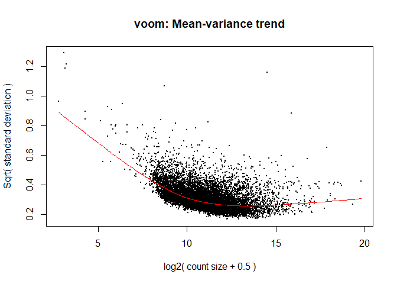<!-- -->

``` r
colnames(mm8)
```

    ##  [1] "exposureCBF" "exposureCBS" "exposureCTR" "exposurePLF" "exposurePLS"
    ##  [6] "exposurePWF" "exposurePWS" "batchNM2"    "batchNM3"    "batchSM1"   
    ## [11] "batchSM2"    "batchSM3"

``` r
fit8 <- lmFit(y8, mm8) # Fitting linear models in limma

head(coef(fit8))
```

    ##                 exposureCBF exposureCBS exposureCTR exposurePLF exposurePLS
    ## ENSG00000225630    4.349668    4.319468    4.281809    4.315832    4.329322
    ## ENSG00000237973    4.240166    4.201619    4.343250    4.419601    4.300250
    ## ENSG00000248527    8.071167    7.923630    8.129646    8.206836    8.136675
    ## ENSG00000228794    3.322995    3.277708    3.447193    3.361794    3.269325
    ## ENSG00000188976    6.385779    6.322941    6.389893    6.352499    6.294513
    ## ENSG00000188290    4.332265    4.080183    4.433186    4.414285    4.393118
    ##                 exposurePWF exposurePWS    batchNM2    batchNM3    batchSM1
    ## ENSG00000225630    4.200406    4.333081 -0.09464684 -0.96651284 -0.83993682
    ## ENSG00000237973    4.186638    4.184813 -0.46353582  0.02798429 -0.47092892
    ## ENSG00000248527    8.038253    8.032188 -0.44596394 -0.41436084 -0.53249785
    ## ENSG00000228794    3.313299    3.237029 -0.26390288 -0.08342387 -0.42714451
    ## ENSG00000188976    6.489615    6.341708 -0.18300320  0.02431689 -0.03052394
    ## ENSG00000188290    4.191658    4.532263 -0.05750631  0.32397295  0.97862890
    ##                     batchSM2    batchSM3
    ## ENSG00000225630  0.015069392 -0.90970656
    ## ENSG00000237973  0.218311377 -0.18805070
    ## ENSG00000248527  0.362686920 -0.50370004
    ## ENSG00000228794 -0.056704666  0.03208013
    ## ENSG00000188976  0.003078177 -0.10740110
    ## ENSG00000188290  0.771186412  0.43165820

``` r
x <- colnames(coef(fit8))
x <- x[1:7] # selecting levels representing the exposure groups 
# to use in "for" loop

a8 <- list() # list of both coding and non-coding transcripts
b8 <- list() # for storing analyzed data fro significantly altered genes
c8 <- list() # for getting the list of all genes 
d8 <- list() # for storing ENSEMBL transcript names

for(i in 1:length(x)){if(x[i] != "exposureCTR"){
  difference <- paste(x[i],"-","exposureCTR", sep="")
  contr <- makeContrasts(difference, levels = colnames(coef(fit8)))
  tmp <- contrasts.fit(fit8, contr)
  tmp <- eBayes(tmp)
  top.table <- topTable(tmp, sort.by = "P", n = Inf)
  l <- length(which(top.table$adj.P.Val < 0.1 & abs(top.table$logFC) > 0.5))
  exposure <- substr(x[i], nchar(x[i])-2, nchar(x[i]))
  print(paste( "Number of transcripts changed in : ", exposure, l))
  silent=TRUE
  top.table <- as.data.frame(top.table)
  try(top.table$symbol <- mapIds(org.Hs.eg.db, keys = row.names(top.table), 
                                 keytype = "ENSEMBL", column = "SYMBOL", 
                                 multiVals="first")) #adding gene names 
  top.table <- subset(top.table, top.table$symbol != 'NA')
  c8[[i]] <- top.table
  names(c8)[i] <- exposure
  top.table<- top.table %>% 
    mutate(direction = case_when(logFC > 0.5 ~ "up",
                                 logFC < -0.5 ~ "down"))
  top.table <- top.table[(which(top.table$adj.P.Val < 0.1 & 
                                  abs(top.table$logFC) > 0.5)),]
  d8[[i]] = row.names(top.table)
  names(d8)[i] <- exposure
  rownames(top.table) <- NULL
  #rownames(top.table) <- top.table$symbol
  top.table <- top.table[(c(7,1,2,3,4,5,6,8))]
  a8[[i]] = top.table$symbol
  names(a8)[i] <- exposure
  b8[[i]] <- top.table
  names(b8)[i] <- exposure}
}
```

    ## [1] "Number of transcripts changed in :  CBF 44"

    ## 'select()' returned 1:many mapping between keys and columns

    ## [1] "Number of transcripts changed in :  CBS 59"

    ## 'select()' returned 1:many mapping between keys and columns

    ## [1] "Number of transcripts changed in :  PLF 32"

    ## 'select()' returned 1:many mapping between keys and columns

    ## [1] "Number of transcripts changed in :  PLS 6"

    ## 'select()' returned 1:many mapping between keys and columns

    ## [1] "Number of transcripts changed in :  PWF 234"

    ## 'select()' returned 1:many mapping between keys and columns

    ## [1] "Number of transcripts changed in :  PWS 3"

    ## 'select()' returned 1:many mapping between keys and columns

``` r
# removing the empty control group from the lists
a8[3] <- NULL 
b8[3] <- NULL 
c8[3] <- NULL
d8[3] <- NULL
```

``` r
names(a8) <- str_replace_all(names(a8), c(CBF= "Male\nCardboard\nFlaming",
                                          CBS= "Male\nCardboard\nSmoldering",
                                          PLF= "Male\nPlastic\nFlaming",
                                          PLS= "Male\nPlastic\nSmoldering",
                                          PWF= "Male\nPlywood\nFlaming",
                                          PWS= "Male\nPlywood\nSmoldering"))

#---------------------------------------------------#
names(b8) <- str_replace_all(names(b8), c(CBF= "Cardboard Flaming",
                                          CBS= "Cardboard Smoldering",
                                          PLF= "Plastic Flaming",
                                          PLS= "Plastic Smoldering",
                                          PWF= "Plywood Flaming",
                                          PWS= "Plywood Smoldering"))

blank_excel <- createWorkbook()

Map(function(df, tab_name){     
  
  addWorksheet(blank_excel, tab_name)
  writeData(blank_excel, tab_name, df)
}, 

b8, names(b8)
)
```

    ## $`Cardboard Flaming`
    ## [1] 0
    ## 
    ## $`Cardboard Smoldering`
    ## [1] 0
    ## 
    ## $`Plastic Flaming`
    ## [1] 0
    ## 
    ## $`Plastic Smoldering`
    ## [1] 0
    ## 
    ## $`Plywood Flaming`
    ## [1] 0
    ## 
    ## $`Plywood Smoldering`
    ## [1] 0

``` r
saveWorkbook(blank_excel, file = "Table E6.xlsx", overwrite = TRUE)
```

Figure 6

``` r
###########################################################

NvS <- c(a5, a6) # non-smoker and smoker donors

NvS_CBf <- NvS[c(1,7)]
names(NvS_CBf) <- sub('\nCardboard\nFlaming','', names(NvS_CBf))

EP_All_CB <- euler(NvS_CBf, shape = "ellipse") # Euler plot 
plot(EP_All_CB,
     quantities = TRUE,
     lty = 2:1, #cex=3,
     main = "Cardboard Flaming",
     labels = list(font = 3, cex = 1.2), 
     fills = c("white","cyan" ))
```

<!-- -->

``` r
NvS_PWf <- NvS[c(5,11)]
names(NvS_PWf) <- sub('\nPlywood\nFlaming','', names(NvS_PWf))

EP_All_PW <- euler(NvS_PWf, shape = "ellipse") # Euler plot 
plot(EP_All_PW,
     quantities = TRUE,
     lty = 2:1, #cex=3,
     main = "Plywood Flaming",
     labels = list(font = 3, cex = 1.2), 
     fills = c("white","cyan" ))
```

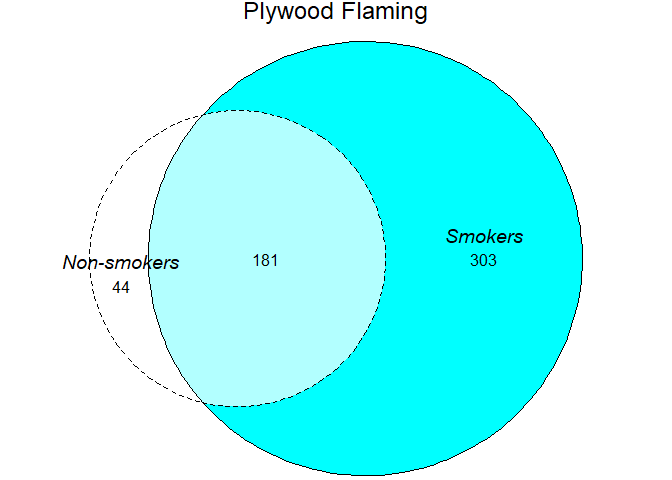<!-- -->

``` r
NvS_PLf <- NvS[c(3,9)]
names(NvS_PLf) <- sub('\nPlastic\nFlaming','', names(NvS_PLf))

EP_All_PL <- euler(NvS_PLf, shape = "ellipse") # Euler plot 
plot(EP_All_PL,
     quantities = TRUE,
     lty = 2:1, #cex=3,
     main = "Plastic Flaming",
     labels = list(font = 3, cex = 1.2), 
     fills = c("white","cyan" ))
```

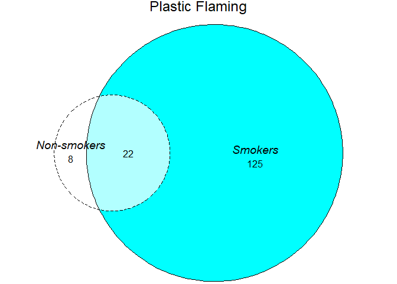<!-- -->

``` r
#---------------------------------------------------------------#

FvM <- c(a7, a8) # female and male donors

FvM_CBf <- FvM[c(1,7)]
names(FvM_CBf) <- sub('\nCardboard\nFlaming','', names(FvM_CBf))

EP_All_CB <- euler(FvM_CBf, shape = "ellipse") # Euler plot 
plot(EP_All_CB,
     quantities = TRUE,
     lty = 1:2, #cex=3,
     main = "Cardboard Flaming",
     labels = list(font = 3, cex = 1.2), 
     fills = c("cyan","white"))
```

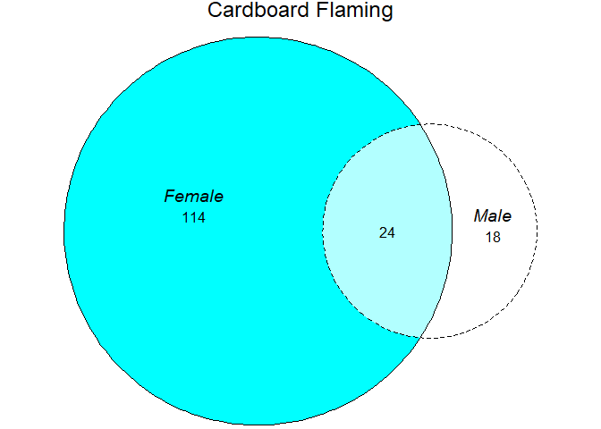<!-- -->

``` r
FvM_PWf <- FvM[c(5,11)]
names(FvM_PWf) <- sub('\nPlywood\nFlaming','', names(FvM_PWf))

EP_All_PW <- euler(FvM_PWf, shape = "ellipse") # Euler plot 
plot(EP_All_PW,
     quantities = TRUE,
     lty = 1:2, #cex=3,
     main = "Plywood Flaming",
     labels = list(font = 3, cex = 1.2), 
     fills = c("cyan","white"))
```

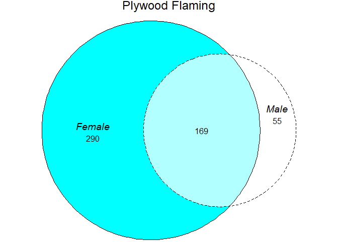<!-- -->

``` r
FvM_PLf <- FvM[c(3,9)]
names(FvM_PLf) <- sub('\nPlastic\nFlaming','', names(FvM_PLf))

EP_All_PL <- euler(FvM_PLf, shape = "ellipse") # Euler plot 
plot(EP_All_PL,
     quantities = TRUE,
     lty = 1:2, #cex=3,
     main = "Plastic Flaming",
     labels = list(font = 3, cex = 1.2), 
     fills = c("cyan","white"))
```

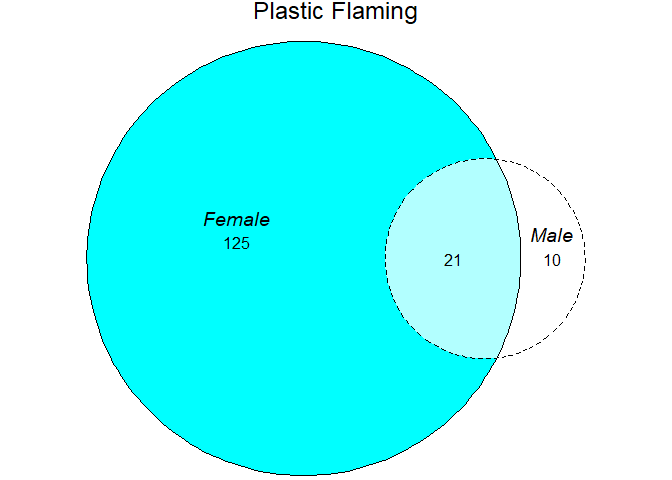<!-- -->

Figure E7

``` r
#----------------------------------------------------------------#

NvS_CBs <- NvS[c(2,8)]
names(NvS_CBs) <- sub('\nCardboard\nSmoldering','', names(NvS_CBs))

EP_All_CBs <- euler(NvS_CBs, shape = "ellipse") # Euler plot 
plot(EP_All_CBs,
     quantities = TRUE,
     lty = 2:1, #cex=3,
     main = "Cardboard Smoldering",
     labels = list(font = 3, cex = 1.2), 
     fills = c("white","cyan" ))
```

<!-- -->

``` r
NvS_PWs <- NvS[c(6,12)]
names(NvS_PWs) <- sub('\nPlywood\nSmoldering','', names(NvS_PWs))

EP_All_PWs <- euler(NvS_PWs, shape = "ellipse") # Euler plot 
plot(EP_All_PWs,
     quantities = TRUE,
     lty = 1:2, #cex=3,
     main = "Plywood Smoldering",
     labels = list(font = 3, cex = 1.2), 
     fills = c("cyan","white" ))
```

<!-- -->

``` r
NvS_PLs <- NvS[c(4,10)]
names(NvS_PLs) <- sub('\nPlastic\nSmoldering','', names(NvS_PLs))

EP_All_PLs <- euler(NvS_PLs, shape = "ellipse") # Euler plot 
plot(EP_All_PLs,
     quantities = TRUE,
     lty = 1:2, #cex=3,
     main = "Plastic Smoldering",
     labels = list(font = 3, cex = 1.2), 
     fills = c("cyan","white"))
```

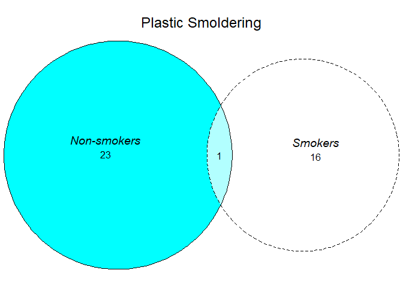<!-- -->

``` r
FvM_CBs <- FvM[c(2,8)]
names(FvM_CBs) <- sub('\nCardboard\nSmoldering','', names(FvM_CBs))

EP_All_CBs <- euler(FvM_CBs, shape = "ellipse") # Euler plot 
plot(EP_All_CBs,
     quantities = TRUE,
     lty = 2:1, #cex=3,
     main = "Cardboard Smoldering",
     labels = list(font = 3, cex = 1.2), 
     fills = c("white","cyan" ))
```

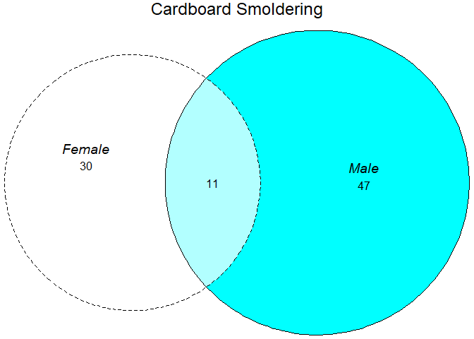<!-- -->

``` r
FvM_PWs <- FvM[c(6,12)]
names(FvM_PWs) <- sub('\nPlywood\nSmoldering','', names(FvM_PWs))

EP_All_PWs <- euler(FvM_PWs, shape = "ellipse") # Euler plot 
plot(EP_All_PWs,
     quantities = TRUE,
     #lty = 1:2, #cex=3,
     main = "Plywood Smoldering",
     labels = list(font = 3, cex = 1.2), 
     fills = c("cyan","white" ))
```

<!-- -->

``` r
FvM_PLs <- FvM[c(4,10)]
names(FvM_PLs) <- sub('\nPlastic\nSmoldering','', names(FvM_PLs))

EP_All_PLs <- euler(FvM_PLs, shape = "ellipse") # Euler plot 
plot(EP_All_PLs,
     quantities = TRUE,
     lty = 2:1, #cex=3,
     main = "Plastic Smoldering",
     labels = list(font = 3, cex = 1.2), 
     fills = c("white","cyan" ))
```

<!-- -->

Figure E8

``` r
library(gprofiler2)
#https://biit.cs.ut.ee/gprofiler/page/apis

# download the GMT file from DisGeNET
gmturl = file.path("http://www.disgenet.org",
                   "static/disgenet_ap1/files/downloads/gmt_files",
                   "disgenet.curated.v7.symbols.gmt")
download.file(url = gmturl, destfile = "DisGeNET.gmt")
# custom annotations ID is gp__D6cZ_pKfE_PvY -downlaoded on April 30th 2024

token = upload_GMT_file(gmtfile = "DisGeNET.gmt")
```

    ## Your custom annotations ID is gp__AjOX_qhoY_TMQ.
    ## You can use this ID as an 'organism' name in all the related enrichment tests against this custom source.

    ## Just use: gost(my_genes, organism = 'gp__AjOX_qhoY_TMQ')

``` r
#####################################################################
DG <- list()

#------------------------------------------------------------------#
PWf_N <- gconvert(d5$PWF, organism="hsapiens") # non-smoker donors

PWf_N = gost(PWf_N$name, 
             organism = token, 
             ordered_query = TRUE)
```

    ## Detected custom GMT source request

``` r
DG$PWf_N <- PWf_N$result

df <- as.data.frame(DG$PWf_N[, c("term_name", "p_value")] )
df <- df %>% mutate(term_name = str_sub(term_name, start = 10L)) %>%
  mutate(term_name = str_replace_all(term_name, "_", " "))
df <- df[order(df$p_value, decreasing = TRUE), ]
df$term_name <- factor(df$term_name, levels = df$term_name)
q1 <-ggplot(df, aes(x=p_value, y=term_name)) +
  geom_col(fill = "#56a0d3") +
  ggtitle("Non-smokers") + xlab("p-value")+
  theme(axis.text.x = element_text(color = "black", size = 16), 
        axis.text.y = element_text(color = "black", size = 16),
        title = element_text(size = 18, face="bold"),
        # axis.title.x = element_blank(),
        axis.title.y = element_blank())+ xlim(0.000, 0.06)
q1 
```

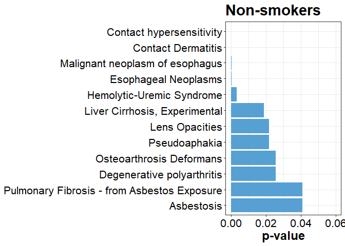<!-- -->

``` r
#------------------------------------------------------------------#
PWf_S <- gconvert(d6$PWF, organism="hsapiens") # smoker donors

PWf_S = gost(PWf_S$name, 
             organism = token, 
             ordered_query = TRUE)
```

    ## Detected custom GMT source request

``` r
DG$PWf_S <- PWf_S$result

df <- as.data.frame(DG$PWf_S[, c("term_name", "p_value")] )
df <- df %>% mutate(term_name = str_sub(term_name, start = 10L)) %>%
  mutate(term_name = str_replace_all(term_name, "_", " "))
df <- df[order(df$p_value, decreasing = TRUE), ]
df$term_name <- factor(df$term_name, levels = df$term_name)
q2 <-ggplot(df, aes(x=p_value, y=term_name)) +
  geom_col(fill = "#56a0d3") +
  ggtitle("Smokers")+  xlab("p-value")+
  theme(axis.text.x = element_text(color = "black", size = 16), 
        axis.text.y = element_text(color = "black", size = 16),
        title = element_text(size = 18, face="bold"),
        #axis.title.x = element_blank(),
        axis.title.y = element_blank())+ xlim(0.000, 0.06)
q2 
```

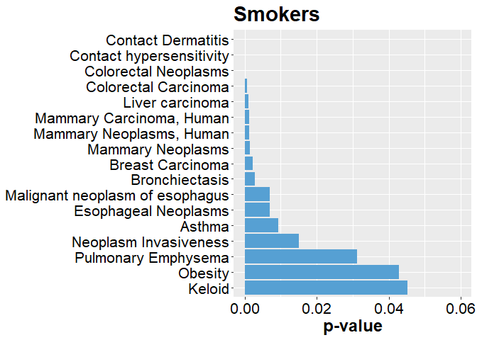<!-- -->

``` r
#------------------------------------------------------------------#
PWf_F <- gconvert(d7$PWF, organism="hsapiens") # female donors


PWf_F = gost(PWf_F$name, 
             organism = token, 
             ordered_query = TRUE)
```

    ## Detected custom GMT source request

``` r
DG$PWf_F <- PWf_F$result

df <- as.data.frame(DG$PWf_F[, c("term_name", "p_value")] )
df <- df %>% mutate(term_name = str_sub(term_name, start = 10L)) %>%
  mutate(term_name = str_replace_all(term_name, "_", " "))
df <- df[order(df$p_value, decreasing = TRUE), ]
df$term_name <- factor(df$term_name, levels = df$term_name)
q3 <-ggplot(df, aes(x=p_value, y=term_name)) +
  geom_col(fill = "#56a0d3") +
  ggtitle("Female donors")+ xlab("p-value")+
  theme(axis.text.x = element_text(color = "black", size = 16), 
        axis.text.y = element_text(color = "black", size = 16),
        title = element_text(size = 18, face="bold"),
        # axis.title.x = element_blank(),
        axis.title.y = element_blank())+ xlim(0.000, 0.06)
q3 
```

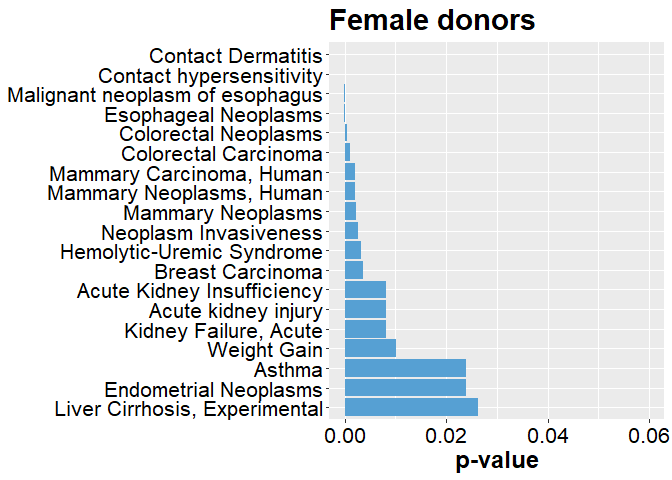<!-- -->

``` r
#------------------------------------------------------------------#
PWf_M <- gconvert(d8$PWF, organism="hsapiens") # male donors

PWf_M = gost(PWf_M$name, 
             organism = token, 
             ordered_query = TRUE)
```

    ## Detected custom GMT source request

``` r
DG$PWf_M <- PWf_M$result

df <- as.data.frame(DG$PWf_M[, c("term_name", "p_value")] )
df <- df %>% mutate(term_name = str_sub(term_name, start = 10L)) %>%
  mutate(term_name = str_replace_all(term_name, "_", " "))
df <- df[order(df$p_value, decreasing = TRUE), ]
df$term_name <- factor(df$term_name, levels = df$term_name)
q4<-ggplot(df, aes(x=p_value, y=term_name)) +
  geom_col(fill = "#56a0d3") +
  ggtitle("Male donors") + xlab("p-value")+
  theme(axis.text.x = element_text(color = "black", size = 16), 
        axis.text.y = element_text(color = "black", size = 16),
        title = element_text(size = 18, face="bold"),
        # axis.title.x = element_blank(),
        axis.title.y = element_blank())+ xlim(0.000, 0.06)

q4
```

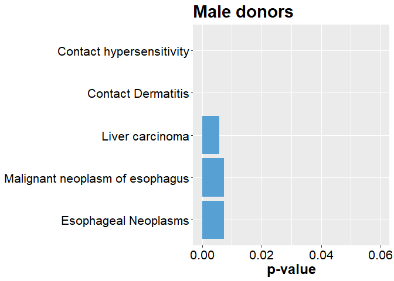<!-- -->

``` r
#---------------------------------------------------#

names(DG) <- str_replace_all(names(DG), c(PWf_N= "Non-smokers",
                                          PWf_S= "Smokers",
                                          PWf_F= "Female",
                                          PWf_M= "Male"))

blank_excel <- createWorkbook()

Map(function(df, tab_name){     
  
  addWorksheet(blank_excel, tab_name)
  writeData(blank_excel, tab_name, df)
}, 

DG, names(DG)
)
```

    ## $`Non-smokers`
    ## [1] 0
    ## 
    ## $Smokers
    ## [1] 0
    ## 
    ## $Female
    ## [1] 0
    ## 
    ## $Male
    ## [1] 0

``` r
saveWorkbook(blank_excel, file = "Table E7.xlsx", overwrite = TRUE)
```

    ## Warning in file.create(to[okay]): cannot create file 'Table E7.xlsx', reason
    ## 'Permission denied'
